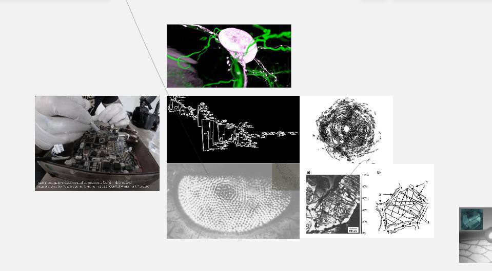

# decay04.github.io
## системы лояльности ##
Проект исследует колониальный характер отношений между рф и странами постсоветского пространства, на примере формирования сетей военной логистики полномасштабного вторжения рф в Украину (2021 г)

**Общее содержание :**

- текст

- видео и расшифровка

- карта 

- english version below

**Содержание текста:**

- системы лояльности.

- импорт рф в цифрах.

- список по странам. 

**Что мы видим на карте поставок оружия и комплектующих?**

Стертые границы.

Гибридные режимы размытия карт транснациональными капиталами и неоколониальными логиками подчинения.

Гибкое модулирование командных сетей​​​​​​​ транснациональных военных подрядчиков в состоянии постоянной войны.

Сети глобальной империи военных концернов и их межнациональную связанность.

Сети материализуют свои границы через детализации связей, имен, адресов и нюансов логистики.

К сети нужно относиться как к процессу и технологии с алгоритмами действия, но не как к обьекту.

Всемирное состояние войны, которое размывает различие
между войной и не-войной​​​​​​​ где «война становится основным принципом организации общественной жизни, а политика — лишь одним из ее инструментов или воплощений​​​​​​​» (А.Негри, М.Хардт «Империя») 

Несмотря на кажущуюся политическую автономию соседних стран  (страны, бывшие в составе СССР: Армения, Казахстан, Кыргызстан, Узбекистан, Таджикистан, Грузия, Молдова и др.), рф продолжает использовать территориальных соседей как транзитную зону обхода блокировок поставок комплектующих для работы ВПК (военно-промышленный комплекс). Границы суверенных территорий переописываются под натиском диффузного пространства сети военных подрядчиков рф. Активируются и проявляются коррупционные маршруты обхода для теневого импорта.

Теневой импорт необходим рф чтобы продолжать пополнять запасы и обслуживать ВПК
 
ВПК рф не самостоятелен и критически зависит от импортных комплектующих.

Это в первую очередь касается БПЛА, средств защищённой связи, микроэлектроники и станков для изготовления деталей.

Российский ВПК является прямым наследником советского.За последние 30 лет в серийное производство было запущено совсем небольшое количество новых образцов вооружений. В основном российский ВПК занимается ремонтом, поддержкой 
1
 и модернизацией того, что было произведено ещё во времена СССР. Новые образцы оружия под внешним корпусом рф, состоят из западных комплектующих на уровне двигателей, оптики, процессоров и микроэлектроники. 

Вопреки мифам о внушительном наследии советского союза, о собственных разработках и мощностях военного производства — ВПК рф представляет из себя плохо скоординрованную, коррумпированную и не самостоятельную сеть полуразрушенных НИИ советского периода. Где импортозамещение микроэлектроники и способов производства происходит лишь на трибунах перед инвесторами и в слабом воображении чиновников, не существуя в реальности. 

Динамику отрасли микроэлектроники и российских разработок, можно проследить на архивированных страницах завода АО Ангстрем (московская компания, занимающаяся проектированием и производством электронных изделий и полупроводников. Компания производила ряд интегральных схем советской эпохи. После распада Советского Союза, в 90-е годы она выпустила линейку калькуляторов и банковских карт.) Завод, что был основан в 1963 под названием НИИ-336,  и как  вся отрасль микроэлектроники рф,  стремительно деградировали после распада СССР 
2

В рф нет разветвлённой сети подрядчиков для военной индустрии. Заказы распределяются непрозрачно внутри крупных холдингов и корпораций. Контроль над выполнением заказов также запрятан глубоко в нутро непрозрачной, но плохо скоординируемой машины. С 2014 года, регистрировалась и создавалась сеть иностранных фирм посредников, позволяющая поставлять комплектующие для производства оружия. Они в свою очередь, направляли чипы,микросхемы и др. военным подрядчикам —  дочерним структурам ВПК рф, главные предприятия которого, уже находились под санкциями.

Политики санкционного бойкота принятые в 2022 (и ранее, в 2014) году ЕС и рядом других стран, не позволяют рф более, получать ресурсы для ведения войны напрямую. Однако, эффект от санкций 
3
, принятых в области военных технологий сильно ослаблен растяженностью во времени, слиянием гражданских и военных технологий и принудительной лояльностью буферных стран, которые использует рф. И главное, рф продолжает получать комплектующие  благодаря старым коррупционным  связям «business as a usual» в европейских странах.

Часть военной логистики реструктурировалась ориентируясь на производства в Иране, Китае и Турции.
Однако западные комплектующие, производящиеся в странах ЕС и в США, попадают в рф через Армению, Казахстан, Кыргызстан, Беларусь, Узбекистан.

Такие сотрудничество и помощь в обходе санкций едва ли можно назвать добровольными для стран бывшего СССР и имеющих общие границы с рф.

Не последнюю роль в колониальных логиках ведения войны ирает и человеческий ресурс. Пользуясь давлением на бывшие советские республики, рф обещает российские паспорта трудовым мигрантам из стран Центральной Азии, за участие в боевых действиях. В 2023 году, в рф происходят облавы и полицейские рейды на мигрантов получивших рф паспорта, с целью вручения им военных повесток. Внешние колониальные логики отражаются во внутренней политике: большая часть армии рф — это представители коренных народов, жители национальных республик и контрактники из экономически не защищенных регионов.
В Алабуге (Татарстан)  насильно привлекаются 15 летние подростки к сборке боевых иранских беспилотников «Шахед» для нужд армии России.
За идеи «русского мира» конечно платят те, кто последовательно эксплуатировался центральными регионами и переживал геноциды и этнические чистки со стороны империи.

Мы хотим подчеркнуть, что страны постсоветского пространства намеренно используются рф, поскольку зависимый характер отношений не создаёт условия для симметричного выбора или возможности принятия автономных решений. На примере Сакартвело легко проследить связи колониального давления. Претерпевая 20% оккупацию своих территорий Россией, Сакартвело не присоединяется к санкционным требованиям ЕС, несмотря на высокий уровень внутренней солидарности жителей Сакартвело по отношению к борьбе Украины и не смотря на то, что Сакартвело в 2023 году стало кандидатом на присоединение к ЕС. На эти видимые противоречия есть массы причин (угроза военного вмешательства со стороны рф, старые коррупционные связи между странами, вынужденное приграничное сотрудничество, транзитные сделки, etc).

Также, роль в зависимых отношениях играет то, что многие страны пост советских территорий связаны с рф вынужденной трудовой миграцией. Семьи мигранто_в раздроблены рабоче-торговыми отношениями и вынужденной языково-культурной интеграцией в рф. Чьи эксплутационные логики (рф) и являются причиной для этой миграции. Финансовые, научные, образовательные, культурные ресурсы стягивались и уплотнялись вокруг центра (москва), не укрепляя и не развивая локальные инфраструктуры, что заставляет людей мигрировать за недостающими потоками, в посиках работы, образования, здравоохранения и улучшения качества жизни. Логики капитала и колониализма следуют симметрично, являясь опорой друг для друга. 

С начала полномасштабного вторжения россии в Украину, границы постсоветских стран испытывают волнения и беспокойства. Напряжение материализуется в приграничные военные конфликты (Таджикистан-Узбекистан, Армения-Азербайджан) и массовые митинги с требованием к локальным властям о прекращении заигрывания с Кремлем. (Армения, Казахстан, Грузия, Молдова).

Россия через внешних агентов влияния оказывает давление и вмешивется в локальные выборы, саботируя проплаченные митинги и беспорядки. Угрожает экономическим давлением и перекрытием доступа к энергетическим ресурсам, принуждая соседние страны к лояльным для себя политическим сделкам.

Мы наблюдаем дифракцию и множественность в идеях территориальной независимости и государственного суверенитета. Логистические потоки бороздят и переочерчивают политико — географические карты, подчиняя себе новые территории и переозначая их. Экономическая зависимость и связанность постсоветского пространства с Центральным аппаратом Кремля, подчиняет себе региональные территории рф в логиках ресурсной экономики и посягает на хрупкие границы с соседними государствами. Москва становится жидкой и липкой материей, расширяя свое присутствие и расширяя сферы влияния в более уязвимые регионы по географическим или экономическими признакам.

Не может быть равных и безопасных отношений с правительством страны, которое смотрит на соседнее независимое государство как на территорию временно- упущенного внимания и не видя в нем субьекта собственной истории. Россия же смотрит на бывшие республики реваншистски и одновременно снисходительно. Истории внешних и внутренних колониальных завоеваний, геноцидов и депортаций царской россии, российской империи и современной россии — все еще покрыты большевисткими мифами о равенстве и дружбе народов и ложными противопоставлениями западному империализму. 

Какие цели у полномасштабного вторжения рф в Украину?
У войны с целью учредить или поддержать
некий социальный порядок завершения может и не быть. Поэтому,
она включает в себя постоянное, ничем не прерываемое
применение насилия и жестокости. В ней
нельзя победить или, точнее говоря, в ней ежедневно приходится побеждать снова и снова. Мы смотрим на политику последовательного геноцида и уничтожения культуры бывшей республики СССР, отмежевавшейся от ксеноненавистнических нарративов «русского мира». 

Рф не интересуют новые территории с точки зрения их локального развития. (это можно проследить на примере оккупации Абхазии и последовавшей брошенностью территорий.) Одновременно с тем, как захватываются новые территории Украины, гниют, численно и экономически отмирают регионы рф, являясь эксплуатационной и репродуктивной зоной обсуживания центра (москва). 

Рф не гнушается заключать временные альянсы для получения оружия и ораганизации серого экспорта нефти с тоталитарными правительсвами таких государств как Иран, Турция, Азербайждан. Азербайджан помогает обходить санкции на продажу нефти и газа  в ЕС — являясь хабом/зоной перераспределения и выдавая рф газ и нефттепродукты — за экспорт нефти и газа Азербайджана. Иран и Турция являются поставщиками беспилотников, выдаваемых затем за местное производство рф (например дроны «Герань», используемые в войне с Украиной) .

Также, рф поддерживает и легитимизирует такие терростические группировки как ХАМАС (Паслестина), Талибан (Афганистан) и расширяет свое присутсвие в странах Африки, участвуя в локальных военных переворотах.

Анализ схем и каналов поставок комплектующих для ВПК рф сообщает о многих странах участниках, помимо бывших советских республик. рф продолжает получать все необходимые товары двойного назначения и критически важные элементы для производства оружия. Крупнейшими партнерами также являются Китай, Турция, Иран. Страны Западной Европы и США разрабатывая и присоединяясь к санкциям вынуждены не продавать детали напрямую, однако это все еще не мешает доставке комплектующих в рф.

Многие западные компании не отвечают на вопросы журналисто: к об экспортных условиях отпуска и способах контроля использования их продукции. 

На данный момент, мы видим устойчивые сети поставок на карте, которые помогают обходить санкционный контроль. И если в случае с постсоветскими странами, во многом, можно понять ситуацию не выбора, то лояльность и ригидность остальных стран: UK, США и стран Западной Европы (Франция, Германия, Австрия, Швейцария) — вызывают вопросы. Вопросы о границах экспансии и скорости геополитического капитала военно промышленной индустрии.

Плохо работают не санкции, но их механизмы принятия и последовательные процедуры исполнения. 

«Ключевое условие, определяющее онтологическую политику — это ее исполнение (performance).» Ан Мари Молл

**сноски:** 

1.

 Х-101 ракета — по меньшей мере 53 типа электронной компонентной базы (микросхемы, чипы) — иностранного производства. В частности, компоненты таких компаний как STMicroelectronics (Швейцария), Vicor (США), XILINX (США), Intel Corporation (США), Texas Instruments (США), ZILOG (США), Maxim Integrated (США) и Cypress Semiconductor (США).

Для производства крылатых ракет морского базирования 3М-14 «Калибр» Россия использует не менее 45 иностранных компонентов. Баллистические ракеты 9М723 и крылатые ракеты 9М728/9М729 из состава комплекса «Искандер» оснащаются как минимум 15 и 32 типами иностранной электронной компонентной базы (ЭКБ) соответственно. А в составе аэробаллистических ракет Х-47М2 «Кинжал» используется не менее 48 иностранных компонентов.

В российской ракете «Торнадо-С», в частности в головной части, был обнаружен чип, изготовленный всемирно известной американской компанией Intel

В августе 2022 года британский Royal United Services Institute (RUSI), также исследовав российские ракеты, установил, что российское оружие критически зависит от западной электроники. Из 450 уникальных компонентов иностранного производства более четверти имели логотип Texas Instruments и Analog Devices — двух американских компаний.

За первые семь месяцев войны Россия импортировала электронных компонентов на $2,6 млрд, не менее чем на $777 млн из них были произведены западными фирмами, говорится в совместном расследовании RUSI (Royal United Services Institute) и Reuters на основе данных российской таможни.

За 2022 год в Россию попали якобы «бытовые» чипы на сумму около $3 млрд https://www.liga.net/politics/articles/zapadnye-tehnogiganty-pomogayut-rossii-bombit-ukrainskie-goroda-kak-eto-ostanovit

2. 

https://en.m.wikipedia.org/wiki/Angstrem_(company) АО Ангстрем (русский: АО Ангстрем) — московская компания, занимающаяся проектированием и производством электронных изделий и полупроводников.
[1]
 Компания производила ряд интегральных схем советской эпохи. После распада Советского Союза, в 90-е годы она выпустила линейку калькуляторов и банковских карт.

https://www.linkedin.com/posts/alexey-evstifeev-9288b829_азарт-ангстрем-analogdevices-activity-7130575077061869568-5zz- 2023 год: радіостанція #Азарт виробництво #Ангстрем, Радіостанція містить п’ять ключових мікросхем #AnalogDevices.

2010 год: 
«Правительство не пустит иностранные детали в оборонные продукты, криптографию и паспортную систему
Чтобы поддержать российскую микроэлектронику, государство согласилось обеспечить местные компании заказами, даже если их продукция дороже иностранных аналогов
Правительство поддержит российскую микроэлектронику» ©

2010 год:
«Нет никакого смысла создавать мощности для массового производства потребительской электроники и электронных компонент с низкой интеллектуальной составляющей, поскольку слишком велико технологическое отставание от мировых лидеров — США, Японии, Азии. Нет ничего страшного в том, что Россия продолжит ввозить из-за рубежа электронику массового спроса — бытовую технику, телевизоры, сотовые телефоны, ГЛОНАСС-навигаторы, банковские и торговые карты и другие „колониальные“ товары (или производить за рубежом для внутреннего потребления, но по российским разработкам), — именно так поступают сегодня все страны» ©

2011 год:
«„Ангстрем“ начал продавать оборудование Huawei»

2011 год: 
«Внешэкономбанк возобновил „Ангстрем-Т“ кредитную линию на 815 млн евро. Договориться с банком, возможно, помог бывший министр связи Леонид Рейман.

Наблюдательный совета ВЭБа одобрил возобновление финансирования «Ангстрем-Т», рассказал «Ведомостям» близкий к совету источник. Речь идет о кредитной линии на 815 млн евро, которую банк выделил этой компании в 2008 г. на закупку лицензий и оборудования AMD, а также на запуск завода микрочипов 0,13-0,11 мкм.» ©

2018 год:
«Санкции США, направленные против зарождающейся в России индустрии высоких технологий, вызвали у российской компании по производству микрочипов значительные финансовые проблемы и задержали запуск инициативы, направленной на производство заменителей западной продукции, сказал владелец фирмы.»
Президент Владимир Путин подчеркнул необходимость развития отечественной технологической отрасли в России, чтобы сделать ее менее зависимой от западного оборудования. Но усилиям Москвы по производству российских микрочипов и другой высокотехнологичной продукции помешали санкции США против ряда российских технологических компаний.Компания «Ангстрем-Т», производящая полупроводники, накопила значительные долги и собирается перейти под управление государственного банка развития ВЭБ после того, как не смогла выплатить кредит в размере 815 миллионов евро» ©

2019 год 
Банкротство.

2023 год 
«Ангстрем» передали под государственное управление по указу о гособоронзаказе,
входит с ГК «Элемент» — совместное предприятие «Ростеха» и АФК «Система», а «Ангстрем-Т» с перешел под контроль госкорпорации »ВЭБ.РФ»

2023 год
разбор на комплектующие украинскими военными экспертами:
«рашистка радіостанція #Азарт виробництво #Ангстрем. Радіостанція містить п’ять ключових мікросхем #AnalogDevices.» ©

Что мы здесь узнаем  о глобальных поставках комплектующих для ВПК, кроме как о беспомощности и рухнувшей внутренней отрасли микроэлектроники рф? Что США наложили санкции в 2016 на Ангстрем-Т из-за аннексии Крыма в 2014, но в 2023 году Ангстрем-Т использует микрочипы произведенные в США.

Санкции США, направленные против зарождающейся в России индустрии высоких технологий, вызвали у российской компании по производству микрочипов значительные финансовые проблемы и задержали запуск инициативы, направленной на производство заменителей западной продукции, сказал владелец фирмы.

## CЕТЬ /расшифровка видео/ ##

в тексте видео использованы цитаты от AMBIENT INFORMATION SYSTEMS Luksch/Patel, полная версия книги доступна здесь http://www.ambienttv.net/love

"Мы плаваем в материализованном потоке данных -

или, точнее, поскольку эти данные

уже интерпретированы и предварительно обработаны,

мы тонем в (не)информации. 

Прежде

чем отчеты "разведки" могут быть проанализированы,

на другом конце Земли уже началась война.
 
Однако сфера

действий индивида становится все более

ограниченной. 

Голосование и потребительская

политика - это строго ограниченные инструменты". ATV 

инфо-техно капитализм, размытые границы между военными и гражданскими технологиями, углеводородные сделки, это просто бизнес, "для наших детей", я просто смотрю на насилие, эскорт субсидия, оцифрованные следы мигрантов - новый вавилон​​​​​​​.

Сети кладут конец постмодернизму и беспомощному гулу абстракции.

Сети могут заменять постмодернистский

релятивизм аналитикой данных, устраняя дезориентацию.

ловушки, тупики, зеркальные залы - также и поля 

и сферы для вмешательства.

понимание сетей как биотехнологии дает возможность соавторства и рацинализации. принимая онтологическую нестабильность как данность мы можем смотреть на способы построения и игры с сетями как на визуализацию идей новых материализмов. 

сеть это больше чем «топология узлов в пространстве" 
скорее материя аффектов, текучих сущностей, одновременно

человеческих и нечеловеческих,

культурных и технологических.

и если именно через узел, сеть материализует свои границы, мы можем влиять и реконфигурировать алгоритмы ее построения.

сколько инженеров и ученых косвенно или напрямую работают на военные исследования?

сеть нарезает, сшивает, фрагментирует.. сеть -  событие , но не обьект. 

​​​​​​​

 

