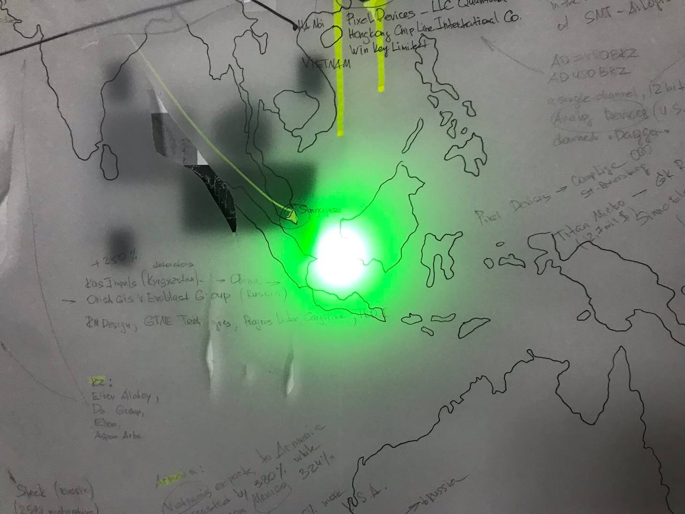
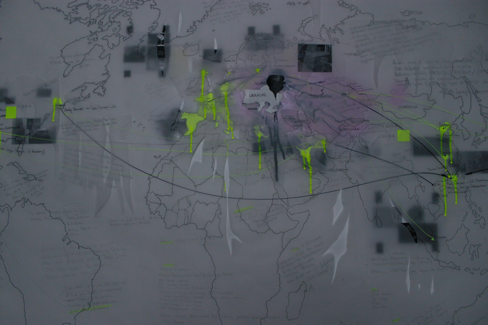

# decay04.github.io
## CИСТЕМЫ ЛОЯЛЬНОСТИ ##
Проект исследует колониальный характер отношений между рф и странами постсоветского пространства, на примере формирования сетей военной логистики полномасштабного вторжения рф в Украину (2021 г)

**Общее содержание :**

- текст

- видео и расшифровка

- карта 

- english version below

**Содержание текста:**

- системы лояльности.

- импорт рф в цифрах.

- список по странам. 

**Что мы видим на карте поставок оружия и комплектующих?**

Стертые границы.

Гибридные режимы размытия карт транснациональными капиталами и неоколониальными логиками подчинения.

Гибкое модулирование командных сетей​​​​​​​ транснациональных военных подрядчиков в состоянии постоянной войны.

Сети глобальной империи военных концернов и их межнациональную связанность.

Сети материализуют свои границы через детализации связей, имен, адресов и нюансов логистики.

К сети нужно относиться как к процессу и технологии с алгоритмами действия, но не как к обьекту.

Всемирное состояние войны, которое размывает различие
между войной и не-войной​​​​​​​ где «война становится основным принципом организации общественной жизни, а политика — лишь одним из ее инструментов или воплощений​​​​​​​» (А.Негри, М.Хардт «Империя») 

Несмотря на [кажущуюся](https://www.bbc.com/russian/news-64630938) политическую автономию соседних стран  (страны, бывшие в составе СССР: [Армения](https://www.nytimes.com/2023/04/18/business/economy/us-russia-chips-sanctions.html?ref=en.thebell.io), Казахстан, [Кыргызстан](https://en.odfoundation.eu/a/627027,russias-accomplices-in-the-war-against-ukraine-kazakhstan-and-kyrgyzstan-the-russian-armys-reliable-rear/#), Узбекистан, Таджикистан, Грузия, [Молдова](https://www.bbc.com/russian/features-64712252) и др.), рф [продолжает использовать](https://eurasianet.org/russias-powerful-economic-levers-over-armenia) территориальных соседей как [транзитную зону обхода блокировок](https://en.thebell.io/russias-big-sanctions-workaround/) поставок комплектующих для работы ВПК (военно-промышленный комплекс). Границы суверенных территорий переописываются [под натиском](https://informnapalm.org/en/advanced-russian-ew-system-navodchik-2-spotted-in-donbas-for-the-first-time/) диффузного пространства сети военных подрядчиков рф. [Активируются](https://www.asiaplustj.info/ru/news/centralasia/20231111/kirgizstan-uzbekistan-i-rossiya-sozdayut-transportnii-koridor-v-obhod-kazahstana) и проявляются коррупционные маршруты обхода для [теневого импорта](https://www.reuters.com/investigates/special-report/ukraine-crisis-russia-tech-middlemen/).

**Теневой импорт необходим рф чтобы продолжать пополнять запасы и обслуживать ВПК**
 
**ВПК рф не самостоятелен и критически зависит от импортных комплектующих.**

**Это в первую очередь касается БПЛА, средств защищённой связи, микроэлектроники и станков для изготовления деталей.**

Российский ВПК является прямым наследником советского.За последние 30 лет в серийное производство было запущено совсем небольшое количество новых образцов вооружений. В основном российский ВПК занимается ремонтом, поддержкой 1
и модернизацией того, что было произведено ещё во времена СССР. Новые образцы оружия под внешним корпусом рф, состоят из западных комплектующих на уровне двигателей, оптики, процессоров и микроэлектроники. 

**Вопреки мифам о внушительном наследии советского союза, о собственных разработках и мощностях военного производства — ВПК рф представляет из себя плохо координированную, коррумпированную и не самостоятельную сеть полуразрушенных НИИ советского периода.** Где импортозамещение микроэлектроники и способов производства происходит лишь на трибунах перед инвесторами и в слабом воображении чиновников, не существуя в реальности. 

Динамику отрасли микроэлектроники и российских разработок, можно проследить на архивированных страницах завода **АО Ангстрем** (московская компания, занимающаяся проектированием и производством электронных изделий и полупроводников. Компания производила ряд интегральных схем советской эпохи. После распада Советского Союза, в 90-е годы она **выпустила линейку калькуляторов и банковских карт.**) Завод, что был основан в 1963 под названием НИИ-336,  и как  вся отрасль микроэлектроники рф,  стремительно деградировали после распада СССР 
2

2010 год: 
"Правительство не пустит иностранные детали в оборонные продукты, криптографию и паспортную систему
Чтобы поддержать российскую микроэлектронику, государство согласилось обеспечить местные компании заказами, даже если их продукция дороже иностранных аналогов
Правительство поддержит российскую микроэлектронику" (с)

2010 год:
"Нет никакого смысла создавать мощности для массового производства потребительской электроники и электронных компонент с низкой интеллектуальной составляющей, поскольку слишком велико технологическое отставание от мировых лидеров — США, Японии, Азии. Нет ничего страшного в том, что Россия продолжит ввозить из-за рубежа электронику массового спроса — бытовую технику, телевизоры, сотовые телефоны, ГЛОНАСС-навигаторы, банковские и торговые карты и другие «колониальные» товары (или производить за рубежом для внутреннего потребления, но по российским разработкам), — именно так поступают сегодня все страны" (с)

2011 год:
"«Ангстрем» начал продавать оборудование Huawei"

2011 год: 

"Внешэкономбанк возобновил «Ангстрем-Т» кредитную линию на 815 млн евро. Договориться с банком, возможно, помог бывший министр связи Леонид Рейман.

Наблюдательный совета ВЭБа одобрил возобновление финансирования «Ангстрем-Т», рассказал «Ведомостям» близкий к совету источник. Речь идет о кредитной линии на 815 млн евро, которую банк выделил этой компании в 2008 г. на закупку лицензий и оборудования AMD, а также на запуск завода микрочипов 0,13-0,11 мкм." (с)

2018 год :
"Санкции США, направленные против зарождающейся в России индустрии высоких технологий, вызвали у российской компании по производству микрочипов значительные финансовые проблемы и задержали запуск инициативы, направленной на производство заменителей западной продукции, сказал владелец фирмы."
Президент Владимир Путин подчеркнул необходимость развития отечественной технологической отрасли в России, чтобы сделать ее менее зависимой от западного оборудования. Но усилиям Москвы по производству российских микрочипов и другой высокотехнологичной продукции помешали санкции США против ряда российских технологических компаний.Компания "Ангстрем-Т", производящая полупроводники, накопила значительные долги и собирается перейти под управление государственного банка развития ВЭБ после того, как не смогла выплатить кредит в размере 815 миллионов евро" (с)

2019 год 
Банкротство.

2023 год 
«Ангстрем» передали под государственное управление по указу о гособоронзаказе,
входит с ГК «Элемент» — совместное предприятие «Ростеха» и АФК «Система», а «Ангстрем-Т» с перешел под контроль госкорпорации «ВЭБ.РФ»

2023 год
разбор на комплектующие украинскими военными экспертами:
"рашистка радіостанція #Азарт виробництво #Ангстрем. Радіостанція містить п'ять ключових мікросхем #AnalogDevices." (с)

Что мы здесь узнаем  о глобальных поставках комплектующих для ВПК , кроме как о беспомощности и рухнувшей внутренней отрасли микроэлектроники рф? Что США наложили санкции в 2016 на Ангстрем-Т из за аннексии Крыма в 2014, но в 2023 году Ангстрем-Т использует микрочипы произведенные в США.

Данные детали важны еще и потому, что радиостанция "Азарт" собранная в "Ангстрем", является частью комплекса РЭР(радио электронная разведка) и РЭБ (радио электронная борьба) РП-377ЛА "Лорандит" , что применяется в войне против Украины. 
РЭР и РЭБ играют ключевые роли в ведении боев, поскольку считывают сигналы БПЛА и вносят помехи в курс пилотирования вражеских БПЛА. 
То есть мы понимаем, что средства радио разведки и радио борьбы рф, не обходятся без западных и китайских производителей. Одновременно с этим, Украине РЭР и РЭБ в качестве лендлизов и помощи не выделяются ни США ни европейскими странами.

В рф нет разветвлённой сети подрядчиков для военной индустрии. Заказы распределяются непрозрачно внутри крупных холдингов и корпораций. Контроль над выполнением заказов также запрятан глубоко в нутро непрозрачной, но плохо скоординируемой машины. С 2014 года, регистрировалась и создавалась сеть иностранных фирм посредников, позволяющая поставлять комплектующие для производства оружия. Они в свою очередь, направляли чипы,микросхемы и др. военным подрядчикам —  дочерним структурам ВПК рф, главные предприятия которого, уже находились под санкциями.

Политики санкционного бойкота принятые в 2022 (и ранее, в 2014) году ЕС и рядом других стран, не позволяют рф более, получать ресурсы для ведения войны напрямую. Однако, эффект от санкций 
3
, принятых в области военных технологий сильно ослаблен растяженностью во времени, слиянием гражданских и военных технологий и принудительной лояльностью буферных стран, которые использует рф. И главное, рф продолжает получать комплектующие  благодаря старым коррупционным  связям «business as a usual» в европейских странах.

Часть военной логистики реструктурировалась ориентируясь на производства в Иране, Китае и Турции.
Однако западные комплектующие, производящиеся в странах ЕС и в США, попадают в рф через Армению, Казахстан, Кыргызстан, Беларусь, Узбекистан.

Такие сотрудничество и помощь в обходе санкций едва ли можно назвать добровольными для стран бывшего СССР и имеющих общие границы с рф.

**Не последнюю роль в колониальных логиках ведения войны ирает и человеческий ресурс.** Пользуясь давлением на бывшие советские республики, рф обещает российские паспорта трудовым мигрантам из стран Центральной Азии, за участие в боевых действиях. В 2023 году, в рф происходят облавы и полицейские рейды на мигрантов получивших рф паспорта, с целью вручения им военных повесток. **Внешние колониальные логики отражаются во внутренней политике: большая часть армии рф — это представители коренных народов, жители национальных республик и контрактники из экономически не защищенных регионов.**
В Алабуге (Татарстан)  насильно привлекаются 15 летние подростки к сборке боевых иранских беспилотников «Шахед» для нужд армии России.
**За идеи «русского мира» платят те, кто последовательно эксплуатировался центральными регионами и переживал геноциды и этнические чистки со стороны империи.**

**Мы хотим подчеркнуть, что страны постсоветского пространства намеренно используются рф, поскольку зависимый характер отношений не создаёт условия для симметричного выбора или возможности принятия автономных решений.** На примере Сакартвело легко проследить связи колониального давления. Претерпевая 20% оккупацию своих территорий Россией, Сакартвело не присоединяется к санкционным требованиям ЕС, несмотря на высокий уровень внутренней солидарности жителей Сакартвело по отношению к борьбе Украины и не смотря на то, что Сакартвело в 2023 году стало кандидатом на присоединение к ЕС. На эти видимые противоречия есть массы причин (угроза военного вмешательства со стороны рф, старые коррупционные связи между странами, вынужденное приграничное сотрудничество, транзитные сделки, etc).

Также, роль в зависимых отношениях играет то, что многие страны пост советских территорий связаны с рф вынужденной трудовой миграцией. Семьи мигранто_в раздроблены рабоче-торговыми отношениями и вынужденной языково-культурной интеграцией в рф. Чьи эксплутационные логики (рф) и являются причиной для этой миграции. Финансовые, научные, образовательные, культурные ресурсы стягивались и уплотнялись вокруг центра (москва), не укрепляя и не развивая локальные инфраструктуры, что заставляет людей мигрировать за недостающими потоками, в посиках работы, образования, здравоохранения и улучшения качества жизни. Логики капитала и колониализма следуют симметрично, являясь опорой друг для друга. 

С начала полномасштабного вторжения россии в Украину, границы постсоветских стран испытывают волнения и беспокойства. Напряжение материализуется в приграничные военные конфликты (Таджикистан-Узбекистан, Армения-Азербайджан) и массовые митинги с требованием к локальным властям о прекращении заигрывания с Кремлем. (Армения, Казахстан, Грузия, Молдова).

**Россия через внешних агентов влияния оказывает давление и вмешивется в локальные выборы, саботируя проплаченные митинги и беспорядки. Угрожает экономическим давлением и перекрытием доступа к энергетическим ресурсам, принуждая соседние страны к лояльным для себя политическим сделкам.**

Мы наблюдаем дифракцию и множественность в идеях территориальной независимости и государственного суверенитета. Логистические потоки бороздят и переочерчивают политико — географические карты, подчиняя себе новые территории и переозначая их. Экономическая зависимость и связанность постсоветского пространства с Центральным аппаратом Кремля, подчиняет себе региональные территории рф в логиках ресурсной экономики и посягает на хрупкие границы с соседними государствами. Москва становится жидкой и липкой материей, расширяя свое присутствие и расширяя сферы влияния в более уязвимые регионы по географическим или экономическими признакам.

Не может быть равных и безопасных отношений с правительством страны, которое смотрит на соседнее независимое государство как на территорию временно- упущенного внимания и не видя в нем субьекта собственной истории. Россия же смотрит на бывшие республики реваншистски и одновременно снисходительно. **Истории внешних и внутренних колониальных завоеваний, геноцидов и депортаций царской россии, российской империи и современной россии — все еще покрыты большевисткими мифами о равенстве и дружбе народов и ложными противопоставлениями западному империализму.** 

Какие цели у полномасштабного вторжения рф в Украину?
**У войны с целью учредить или поддержать
некий социальный порядок завершения может и не быть. Поэтому,
она включает в себя постоянное, ничем не прерываемое
применение насилия и жестокости. В ней
нельзя победить или, точнее говоря, в ней ежедневно приходится побеждать снова и снова.** Мы смотрим на политику последовательного геноцида и уничтожения культуры бывшей республики СССР, отмежевавшейся от ксеноненавистнических нарративов «русского мира». 

Рф не интересуют новые территории с точки зрения их локального развития. (это можно проследить на примере оккупации Абхазии и последовавшей брошенностью территорий.) Одновременно с тем, как захватываются новые территории Украины, гниют, численно и экономически отмирают регионы рф, являясь эксплуатационной и репродуктивной зоной обсуживания центра (москва). 

Рф не гнушается заключать временные альянсы для получения оружия и ораганизации серого экспорта нефти с тоталитарными правительсвами таких государств как Иран, Турция, Азербайждан. Азербайджан помогает обходить санкции на продажу нефти и газа  в ЕС — являясь хабом/зоной перераспределения и выдавая рф газ и нефттепродукты — за экспорт нефти и газа Азербайджана. Иран и Турция являются поставщиками беспилотников, выдаваемых затем за местное производство рф (например дроны «Герань», используемые в войне с Украиной) .

Также, рф поддерживает и легитимизирует такие терростические группировки как ХАМАС (Палестина), Талибан (Афганистан) и расширяет свое присутсвие в странах Африки, участвуя в локальных военных переворотах.

Анализ схем и каналов поставок комплектующих для ВПК рф сообщает о многих странах участниках, помимо бывших советских республик. рф продолжает получать все необходимые товары двойного назначения и критически важные элементы для производства оружия. Крупнейшими партнерами также являются Китай, Турция, Иран. Страны Западной Европы и США разрабатывая и присоединяясь к санкциям вынуждены не продавать детали напрямую, однако это все еще не мешает доставке комплектующих в рф.

Многие западные компании не отвечают на вопросы журналисто: к об экспортных условиях отпуска и способах контроля использования их продукции. 

На данный момент, мы видим устойчивые сети поставок на карте, которые помогают обходить санкционный контроль. И если в случае с постсоветскими странами, во многом, можно понять ситуацию не выбора, то лояльность и ригидность остальных стран: UK, США и стран Западной Европы (Франция, Германия, Австрия, Швейцария) — вызывают вопросы. Вопросы о границах экспансии и скорости геополитического капитала военно промышленной индустрии.

**Плохо работают не санкции, но их механизмы принятия и последовательные процедуры исполнения.** 

«Ключевое условие, определяющее онтологическую политику — это ее исполнение (performance).» Ан Мари Молл

**сноски:** 

1.

 Х-101 ракета — по меньшей мере 53 типа электронной компонентной базы (микросхемы, чипы) — иностранного производства. В частности, компоненты таких компаний как STMicroelectronics (Швейцария), Vicor (США), XILINX (США), Intel Corporation (США), Texas Instruments (США), ZILOG (США), Maxim Integrated (США) и Cypress Semiconductor (США).

Для производства крылатых ракет морского базирования 3М-14 «Калибр» Россия использует не менее 45 иностранных компонентов. Баллистические ракеты 9М723 и крылатые ракеты 9М728/9М729 из состава комплекса «Искандер» оснащаются как минимум 15 и 32 типами иностранной электронной компонентной базы (ЭКБ) соответственно. А в составе аэробаллистических ракет Х-47М2 «Кинжал» используется не менее 48 иностранных компонентов.

В российской ракете «Торнадо-С», в частности в головной части, был обнаружен чип, изготовленный всемирно известной американской компанией Intel

В августе 2022 года британский Royal United Services Institute (RUSI), также исследовав российские ракеты, установил, что российское оружие критически зависит от западной электроники. Из 450 уникальных компонентов иностранного производства более четверти имели логотип Texas Instruments и Analog Devices — двух американских компаний.

За первые семь месяцев войны Россия импортировала электронных компонентов на $2,6 млрд, не менее чем на $777 млн из них были произведены западными фирмами, говорится в совместном расследовании RUSI (Royal United Services Institute) и Reuters на основе данных российской таможни.

За 2022 год в Россию попали якобы «бытовые» чипы на сумму около $3 млрд https://www.liga.net/politics/articles/zapadnye-tehnogiganty-pomogayut-rossii-bombit-ukrainskie-goroda-kak-eto-ostanovit

2. 

https://en.m.wikipedia.org/wiki/Angstrem_(company) АО Ангстрем (русский: АО Ангстрем) — московская компания, занимающаяся проектированием и производством электронных изделий и полупроводников.

 Компания производила ряд интегральных схем советской эпохи. После распада Советского Союза, в 90-е годы она выпустила линейку калькуляторов и банковских карт.

https://www.linkedin.com/posts/alexey-evstifeev-9288b829_азарт-ангстрем-analogdevices-activity-7130575077061869568-5zz- 2023 год: радіостанція #Азарт виробництво #Ангстрем, Радіостанція містить п’ять ключових мікросхем #AnalogDevices.

Санкции США, направленные против зарождающейся в России индустрии высоких технологий, вызвали у российской компании по производству микрочипов значительные финансовые проблемы и задержали запуск инициативы, направленной на производство заменителей западной продукции, сказал владелец фирмы.

## CЕТЬ /расшифровка видео/ ##

в тексте видео использованы цитаты от AMBIENT INFORMATION SYSTEMS Luksch/Patel, полная версия книги доступна здесь http://www.ambienttv.net/love

"Мы плаваем в материализованном потоке данных -

или, точнее, поскольку эти данные

уже интерпретированы и предварительно обработаны,

мы тонем в (не)информации. 

Прежде

чем отчеты "разведки" могут быть проанализированы,

на другом конце Земли уже началась война.
 

Однако сфера

действий индивида становится все более

ограниченной. 

Голосование и потребительская

политика - это строго ограниченные инструменты". ATV 

инфо-техно капитализм, размытые границы между военными и гражданскими технологиями, углеводородные сделки, это просто бизнес, "для наших детей", я просто смотрю на насилие, эскорт субсидия, оцифрованные следы мигрантов - новый вавилон​​​​​​​.

Сети кладут конец постмодернизму и беспомощному гулу абстракции.

Сети могут заменять постмодернистский

релятивизм аналитикой данных, устраняя дезориентацию.

ловушки, тупики, зеркальные залы - также и поля 

и сферы для вмешательства.

понимание сетей как биотехнологии дает возможность соавторства и рацинализации. принимая онтологическую нестабильность как данность мы можем смотреть на способы построения и игры с сетями как на визуализацию идей новых материализмов. 

сеть это больше чем «топология узлов в пространстве" 
скорее материя аффектов, текучих сущностей, одновременно

человеческих и нечеловеческих,

культурных и технологических.

и если именно через узел, сеть материализует свои границы, мы можем влиять и реконфигурировать алгоритмы ее построения.

сколько инженеров и ученых косвенно или напрямую работают на военные исследования?

сеть нарезает, сшивает, фрагментирует.. сеть -  событие , но не обьект. 

​​​​​​​

"Мы рассматриваем сети передачи данных как творческую

среду не для того, чтобы прославлять технологическую

идею прогресса, а для того, чтобы демистифицировать

технологии повседневной жизни - сделать их

видимыми и поощрять продуктивное использование

, а не потребление, чтобы мы могли

ответственно использовать значительную

мощь, которая находится в пределах нашей досягаемости".

сеть может быть эффективной организационной формой а потому, легко может стать пространством захвата - тоталитарным пространством. пространством диффузных форм контроля.

путь монстра, технологически раздутого властью,

кооптированного в эксплуатацию - независимо

от того, сможем ли мы примириться с репрессиями или нет, каждый восьмой человек на земле живет в

трущобах, остальные будут перемещаться туда-сюда между

зоной развлечений и зоной экспортных  /экскортных/ субсидий. ATV

и если Сеть обладает способностью « трансформироваться и мутировать»

она не аутопоэтична хотя 

Технология обеспечивает свои собственные точки стыковки, отсюда

и название "материальной семиотики" (Донна Харуэй)

где технологические средства

, с помощью которых

получаются данные, являются сопродюсерами

смысла (Б. Латур)

где пролегает граница 

"неврологического поворота" - попытке

когнитивного картирования

нашего поведения через Интернет и  граница политик сбора данных и выбранной отчужденности/игнорирования от внедрения сетей в нашу повседневность? 

Кто спонсирует твою кафедру и твои исследования?

## ОБЩИЕ ЦИФРЫ ИМПОРТА РФ: ##

(информация собрана из открытых источников)

Основной рост экспорта из ЕС в страны бывшего СССР пришелся именно на товары, которые подпали под антироссийские санкции, — он составил 95%. Экспорт этих товаров в Россию рухнул на 71%. Например, в ноябре 2021 года совокупный экспорт этих типов товаров в Беларусь, Армению, Грузию, Казахстан, Узбекистан и Кыргызстан составил всего €500 млн, а в ноябре 2022 года вырос в три раза и составил уже €1,5 млрд.

За последние полгода 2023 российские власти растаможили компоненты американских Analog Devices Inc. на сумму более $98 млн, Xilinx — более $75 млн, Microchip Technology — более $42 млн, Texas Instruments — не менее $38 млн, а также Infineon, крупнейшего в Германии производителя полупроводников, — более $28 млн, следует из таможенных данных. Ещё в Россию ввезли продукции Marvell (производитель чипов) на сумму более $11 млн, Cypress Semiconductor — более $3,8 мл и Atmel — более $2,7 млн.

Кроме того, в Россию ввезли продукцию американских Intel и AMD, в том числе микропроцессоры, на сумму более $169 млн и $35 млн соответственно.

Крупнейшим торговым партнером РФ является Китай, в 2022 году нарастивший экспорт в Россию на 8,5 млрд дол. по сравнению с 2021-м свидетельствуют данные UN Comtrade. Но в процентном выражении это не самый большой рост: здесь первые пять мест занимают Турция, Армения и страны Средней Азии. 

По данным британского Королевского института оборонных исследований (RUSI), Россия так и не прекратила завозить западную электронику. С марта по октябрь 2022 года ее импортировали больше чем на 2,6 млрд долларов, причем почти 777 млн пришлось на чипы и компоненты таких компаний, как Intel, AMD, Texas Instruments и Analog Devices.

Еще любопытнее выглядит анализ, проведенный экспертами Euromonitor. Он показал: экспорт товаров из Евросоюза в Россию с марта по ноябрь 2022 года упал на 47%, а в Белоруссию, Армению, Казахстан, Грузию, Узбекистан и Киргизию за то же время увеличился на 48%, сообщил РБК. ​​​​​​​

С начала тотального вторжения в Украину, Россия возрастила стоимость импортной микроэлектроники до $2,45 млрд по сравнению с $1,8 млрд в 2021 году. Международная рабочая группа по российским санкциям и дентифицированный в российском оружии используются не менее 1057 иностранных комплектующих производства 155 компаний.

## Краткая информация по ​​​​​​​СТРАНАМ ОБХОДА САНКЦИЙ И ВВОЗА СЕРОГО ЭКСПОРТА: ##

## КАЗАХСТАН: ##

Хотя правительство страны заявило о нейтралитете в русско-украинской войне, ее торговля с Россией свидетельствует об обратном. Казахстан стал основным каналом поставок технологий в Россию и обхода западных санкций. В прошлом году импорт Казахстана из ЕС вырос на 89 процентов, достигнув 10,4 миллиарда евро. Это увеличение включает значительный объем закупок технологий и оборудования (на сумму примерно 4 млрд евро). Товары на сумму около 2,6 млрд евро пропали без вести, превратившись таким образом в «товары-призраки» — товары, которые были официально закуплены Казахстаном в ЕС, но так и не дошли до потребителей в Центральной Азии.

В 2022 году товарооборот ЕС с Казахстаном составил 40,2 млрд евро, что на 74% больше, чем в 2021 году. Экспорт ЕС составил 10,4 млрд евро, что на 89% больше, чем в 2021 году, а импорт из Казахстана достиг 29,8 млрд евро (рост на 70% по сравнению с 2021 годом). 2021). Торговый баланс составил 19,5 млрд евро в пользу Казахстана по сравнению с 12,1 млрд евро в пользу Казахстана в 2021 году. 
 
Почти 1 миллиард из этой суммы пошел на технику и машиностроение, хотя большую часть этих товаров Казахстан не производит. В прошлом году Казахстан продал России полупроводниковых компонентов на 3,3 миллиона евро, хотя в 2021 году объем этой торговли составил всего 11 тысяч евро.

Вице-премьер-министр Казахстана Серик Жуангарин, который также является министром торговли и интеграции этой центральноазиатской страны, подтвердил сообщения о том, что Казахстан экспортировал подпадающие под санкции технологии двойного назначения российским компаниям, которые, по мнению журналистов-расследователей, участвуют в поддержке войны Москвы в Украине. Жуангарин сообщил 27 июня, что правительство Казахстана в настоящее время работает над предотвращением экспорта 104 видов товаров в Россию, добавив, что усилен контроль над компаниями, занимающимися таким экспортом 

Рост экспорта Германии 136% с Казахстаном​​​​​​​.

По словам источника редакции, который поставляет Казахстану продукцию из Китая, существует специальный «зеленый» список компаний, транспортные средства которых не досматриваются: «Компании в списке постоянно меняются, поэтому отследить их сложно. Список составлен, по его словам, „теми, кто наверху“.

Подробнее о том, что происходит на сухопутной границе между Россией и Казахстаном, вы можете узнать из этого видеоотчета.Более 500 дронов в 2022 году в Россию отправила казахстанская компания «Аспан арба». Она была зарегистрирована в Казахстане уже после начала войны — в апреле 2022 года. Отраслевой портал Metalmininginfo сообщал, что «Аспан арба» будет официальным дилером дронов DJI в Казахстане и станет поставлять коптеры для горнодобывающей промышленности, «строительства, электроэнергетики, поисково-спасательных операций и сельского хозяйства».​​​​​​​

Как свидетельствуют данные министерства цифрового развития, оборонной и аэрокосмической промышленности Казахстана, «Аспан арба» получила лицензию на импорт 18 тысяч беспилотников DJI на 45 миллионов долларов. Экспортер — компания DJI Europe B.V., нидерландская дочка китайской компании. 500 беспилотников «Аспан арба» отправила в Россию «Небесной механике».

«Аспан арба» можно перевести с казахского как «небесная повозка». Но у казахстанской и российской компаний похожи не только названия. «Небесной механикой» владеет Илья Гольберг — так же зовут основателя «Аспан арба». Нынешний директор «Аспан арба» Михаил Сапожников ранее был совладельцем «Небесной механики» вместе с Гольбергом. Указанные на сайте «Аспан арба» телефоны в утечке данных курьерской компании СДЭК фигурируют как телефоны сотрудника «Небесной механики».Кто еще закупал дроны у «Небесной механики»?

В апреле 2022 года дроны DJI Mavic 2 общей стоимостью 11 миллионов рублей у «Небесной механики» купила московская областная федерация ветеранов вооруженных конфликтов «Рысь». Ее основатель и единственный член правления, указанный на сайте, — подполковник спецназа Андрей Межевых

Крупнейшим покупателем «Небесной механики» в 2022 — начале 2023 года была компания «Диджейай арс Москва», которая получила товаров почти на 500 миллионов рублей. «Диджейай арс» под брендом Digbox продает беспилотники и другую технику на Ozon .

В 2022 и начале 2023 года Elix-st отправила Da Group в Казахстан комплектующих более чем на $800 тыс, включая продукцию таких производителей, как Analog Devices, Infineon, Texas Instruments, STMicroelectronics, которые утверждают, что больше не сотрудничают с Россией. Da Group, в свою очередь, отправляет комплектующие в Россию, в основном компании «Стэк». Так, в январе 2023 года Da Group получила из Германии 2598 интегральных микросхем марки Onsemi от Elix-st. В том же месяце 2598 микросхем из Германии были отправлены Da Group в Россию компании «Стэк». При этом в 2018–2021 годах, то есть до войны, Elix-st вообще не ввозила товары в Казахстан (а в Россию, наоборот, ввозила).​​​​​​​

Как «Стэк» получал нужные комплектующие?

В пригороде Штутгарта — одного из важнейших промышленных центров Германии — расположен офис компании Elix-st. Ей владеют россияне — Евгений и Елена Чернет. В России им принадлежит похожая по названию компания «Эликс-М».А в казахстанской Астане в марте прошлого года была зарегистрирована компания Da Group 22. Ее владелец и руководитель — Александр Чернет.​​​​​​​

 В 2022–2023 годах «Стэк» ввезла из Казахстана комплектующих (интегральных схем, диодов, транзисторов и других) на 4,2 миллиона долларов. Таможенные данные не содержат информации о том, продукция каких производителей это была, однако есть данные о странах происхождения товара — это Гонконг, Германия, Нидерланды, Сингапур.

В числе клиентов «Стэк» на сайте упоминается особое конструкторское бюро МЭИ — разработчик радиотехнических систем в составе «Роскосмоса», и «Московский прожекторный завод» — производитель систем электроснабжения для российских ракетных комплексов.​​​​​​​

Еще одна компания, импортирующая американскую микроэлектронику в Россию, — российская «Прайм-эк». В частности, через Казахстан в 2022–2023 годах она ввезла комплектующих на $3,1 млн.Сама «Прайм-эк» ничем особенно не известна, но у нее есть партнер с похожим названием — «Прайм», которой «Прайм-эк» поставила в 2022 году электронных компонентов более чем на 100 млн рублей. Их офисы находились в одном здании, а контактный телефон, указанный на сайте «Прайма», в утечке данных курьерской службы СДЭК фигурирует как телефон «Прайм-эк».В прошлом году одним из крупнейших клиентов «Прайма» стало пензенское производственное объединение «Электроприбор», входящее в концерн «Автоматика» «Ростеха». Оно производит средства связи для Минобороны, например комплекс П-240И, который российские военные в Украине используют для связи в полевых условиях.

Но за один день в декабре 2022 года казахстанская фирма под названием EltexAlatau экспортировала в Россию более 100 партий электроники двойного назначения.

Мировой импорт компьютеров в Казахстан вырос в семь раз до 1,2 миллиарда долларов в 2022 году по сравнению с предыдущим годом, включая 310 миллионов долларов из ЕС. Тем временем казахстанский экспорт в Россию в этой категории вырос более чем в 2300 раз по сравнению с предыдущим годом и составил почти 300 миллионов долларов.
Между тем, согласно торговым данным ООН, Кыргызстан в 2021 году не импортировал и не экспортировал ни одной детали для самолетов, вертолетов или беспилотных летательных аппаратов. Но в 2022 году кыргызские фирмы импортировали такие детали на 3,5 миллиона долларов — в основном из Соединенных Штатов - и экспортировали на 1,5 миллиона долларов в Россию.

​​​​​​​
## КЫРГЫЗСТАН: ##

За 2022 общий объем импорта товаров в Кыргызстан увеличился с 5,5 млрд долларов США до 9,6 млрд долларов США, увеличившись на 72,6% по сравнению с 2021 годом. Из них импорт «машин, оборудования и аппаратуры» вырос с 770 миллионов долларов до 1,6 миллиарда долларов, или более чем в 2 раза, в то время как экспорт «машин, оборудования и аппаратуры» почти удвоился — со 101 миллиона долларов до 197 миллионов долларов.

Россия является вторым по величине торговым партнером Кыргызстана после Китая, на ее долю приходится 27,4% от общего товарооборота Кыргызстана со всеми странами. Внешнеторговый оборот Кыргызстана с Россией в 2022 году увеличился на 40,3% по сравнению с 2021 годом, в то время как экспорт из Кыргызстана в Россию увеличился на 245% с 393 млн долларов США до 963 млн долларов США в 2022 году. Россия является крупнейшим экспортным направлением для Кыргызстана с общей долей 44,1%, что делает Кыргызстан экономически зависимым от России.

Экспорт из Киргизии вырос на 250% и превысил $960 млн.При этом некоторые товары (такие как прицелы для винтовок) ранее Кыргызстаном в Россию не поставлялись. 

После вторжения России в Украину немецкий экспорт в Кыргызстан взлетел до небес на 994%, достигнув 170 млн евро.​​​​​​​

Например, «Кас Импульс» (первый детонаторный завод в Центральной Азии) в январе–апреле 2020 года поставил в Россию 661 тысячу детонаторов23. Сам завод произвел не менее 19,6 тысяч из них, остальные, возможно, были отправлены из Китая. Получателем стала компания ORICA CIS, входящая в группу «Эвобласт» — российский производитель промышленных взрывчатых веществ и систем инициирования для горнодобывающей и строительной отрасли.

Ни одна из поставок «Кас Импульс» не отражена в официальной статистике Кыргызстана. Трудно оценить, сколько еще подобных поставок «исчезло» из отчетов.

Согласно торговым данным ООН, Кыргызстан не импортировал никаких запчастей для самолетов, вертолетов и беспилотных летательных аппаратов в 2021 году. Но в 2022 году страна импортировала таких продуктов на 3,5 миллиона долларов — в основном из Соединенных Штатов — и экспортировала в Россию на 1,5 миллиона долларов.

Кыргызстан экспортировал в Россию 115 920 электродетонаторов на сумму 882 400 долларов США в 2022 году, хотя в 2021 году никаких поставок не производил. Электродетонаторы используются при производстве противопехотных и противотанковых мин. Кыргызстан, со своей стороны, импортировал в 2022 году 193 536 электродетонаторов из Канады на сумму 3,7 миллиона долларов. Есть основания полагать, что Кыргызстан реэкспортировал электродетонаторы канадского производства в Россию.

Экспорт военного оборудования для радаров, радионавигации и дистанционного управления в 2022 году составил 169 800 долларов США, увеличившись на 60% по сравнению с 2021 годом.

Объем оптических прицелов (для оружия), экспортированных из Кыргызстана в Россию в 2022 году, составил 199 700 долларов США, что в 13 раз больше, чем в 2021 году.

Поставки запчастей для самолетов, вертолетов и беспилотных летательных аппаратов из Кыргызстана в Россию выросли с нуля в 2021 году до 1,5 млн долларов в 2022 году.

В 2019–2021 годах Кыргызстан не экспортировал части лазеров, приборов и оптических приборов в Россию, но в 2022 году экспорт достиг 193 100 долларов США.

Кампании: ​​​​​​​

Тро.Я — за поддержку военного сектора России.
Компания RM Design and Development произвела сотни поставок полупроводников, электронных интегральных схем и конденсаторов.
«GTME Technologies» — по мнению Министерства финансов США, поставляла в Россию танталовые конденсаторы и электронные интегральные схемы.
«Прогресс Лидер» — поставила ряд товаров российской компании Siaisi, которая в основном торгует электронным и «Карголайн» — поставила в Россию товары, подпадающие под санкции, на сумму 1 миллион долларов. В частности,  оптическим оборудованием и компьютерами.
авиационные запчасти для Boeing и Airbus.

Weitmann Handeln Allianz завозила в 2022 году швейцарское оборудование от Essemtec.​​​​​​​

## АРМЕНИЯ: ##

экспорт Армении в Россию вырос на 187% за 2022 год и достиг $2,37 млрд.

В документе, отмеченном печатью Бюро промышленности и безопасности США, говорится, что в 2022 году Армения импортировала на 515 процентов больше чипов и процессоров из США и на 212 процентов больше из Евросоюза, чем в 2021 году. Тогда Армения экспортировала 97 процентов этих чипов и процессоров. ту же продукцию в Россию, говорится в документе.

В другом документе Бюро промышленности и безопасности определило восемь категорий микросхем и компонентов, которые считаются критически важными для разработки российского оружия, в том числе одну, называемую программируемой вентильной матрицей, которая была обнаружена в одной из моделей российской крылатой ракеты Х-101.

В одном из документов с печатью Бюро промышленности и безопасности США говорится, что в 2022 году Армения импортировала на 515% больше чипов и процессоров из США и на 212% больше из ЕС, чем в 2021 году, отмечается в статье.  «Затем Армения реэкспортировала 97% этой же продукции в Россию» 

172% увеличился экспорт Германии с Арменией​​​​​​​ 

Общий объем торговли за январь–август 2023 года превысил 4,16 миллиарда долларов, что является рекордным показателем со времен распада Советского Союза. Экспорт из Армении в Россию за этот период составил 2,3 миллиарда долларов и впервые превысил показатель импорта, который составил 1,86 миллиарда долларов.​​​​​​​

Экспорт Вьетнама в Армению вырос на 380 процентов, в то время как экспорт из Мексики вырос на 324 процента, а из Японии — на 252 процента. Ссылаясь на документ Бюро промышленности и безопасности США, New York Times недавно сообщила, что в 2022 году Армения «импортировала на 515 процентов больше чипов и процессоров из Соединенных Штатов и на 212 процентов больше из Европейского Союза, чем в 2021 году. Затем Армения экспортировала 97 процентов тех же продуктов в Россию.​​​​​​​

кампании: 
Tako LLC из Армении (под санкциями) 

## ТАДЖИКИСТАН: ##

154% увеличился экспорт Германии с Таджикистаном 

## ГРУЗИЯ : ##

92% с Грузией увеличился экспорт Германии

## МОЛДОВА : ##

Молдавская Max Jet Service с начала войны отправила в Россию авиазапчастей на 0,5 млрд рублей, в том числе для Boeing и Airbus. Основатель Max Jet Service Сергей Ранга​​​​​​​  https://istories.media/stories/2023/09/12/pochemu-samoleti-v-rossii-vse-yeshche-letayut/?ref=en.thebell.io

## УЗБЕКИСТАН : ##

MVizion завозила оборудование и микросхемы для одного из подрядчиков производителя «Ланцетов»

В отличие от персональных санкций против Усманова, введённых в прошлом году Соединёнными Штатами, Европейским союзом, Великобританией и Швейцарией, министерство финансов лишь упомянуло, что Лондон присоединился к более целенаправленным санкциям против USM Holdings.

Хотя большая часть крупнейших активов USM находится в России, этот шаг также был направлен против «Ахангаранцемента», крупнейшей цементной компании Узбекистана, и Digital Invest — компании, которая, как сообщает частный узбекский новостной сайт Gazeta.uz, владеет долей в телекоммуникационном концерне Ucell и «управляет системой маркировки» в Узбекистане.

## СТРАНЫ ПРОДОЛЖАЮЩИЕ ОБСЛУЖИВАТЬ РФ ВПК: ##

## ШВЕЙЦАРИЯ: ##

Нейросети для Минобороны:

Семья главы «Роскосмоса» Юрия Борисова, который ранее курировал закупки вооружения в Минобороны и в качестве вице-премьера правительства, контролирует оборонного подрядчика АО НТЦ «Модуль». В частности, Минобороны закупало ускоритель нейросетей разработки НТЦ «Модуль». Электрическое же оборудование «Модуль» закупает в Швейцарии, у фирмы E-tec Interconnect AG.

швейцарская компания CODERE,  продолжала поставлять оборудование на попавший под санкции завод " Электромашина» в России, который производит компоненты для российских танков.​​​​​​​ Оно было приобретено за 155,5 млн рублей через посредника, компанию Galika-CTS.

GF Machining Solutions.

В 2018 году ОАО В 2017 году Ижевский механический завод в Удмуртии приобрел электроэрозионный станок AgieCharmilles CUT 20 P от швейцарской GF Machining Solutions за 169 648 евро. https://informnapalm.org/en/how-companies-from-switzerland-italy-and-germany-help-russia-circumvent-sanctions-to-produce-weapons/

Швейцарский производитель Fritz Studer AG также сотрудничает с Россией. В 2018 году компания поставила два универсальных круглошлифовальных станка Studer S21 с ЧПУ крупнейшему предприятию авиационного и космического двигателестроения Российской Федерации ПАО «Кузнецов» в Самаре. Это обошлось более чем в 316 миллионов рублей.

По заказу Министерства обороны Российской Федерации «Кузнецов» производит двигатели для стратегических бомбардировщиков Ту-160 «Белый лебедь», глубоко модернизированных самолетов Ту-160М, Ту-95МС и дальнемагистральных самолетов Ту-22М3. Сейчас россияне активно используют все эти самолеты в войне на Украине.

А в 2019 году швейцарский производитель выполнил заказ единственной компании, производящей ракеты для зенитных комплексов С-300 и С-400 — АО «ММЗ Авангард» (Москва). Российские войска под Харьковом использовали это оружие — зенитно-ракетные дивизионы С-400 и С-300 — в апреле 2022 года.

Российский клиент получил от швейцарской компании прецизионный круглошлифовальный станок с ЧПУ с функцией обработки наружной и внутренней резьбы S30 стоимостью более 382 000 евро .​​​​​​​Конструкторское бюро приборостроения в Туле получило оборудование стоимостью более 722 млн рублей от швейцарской компании GF Machining Solutions. В частности, российская компания приобрела 23 фрезерных станка MIKRON HPM 600HD, 12 фрезерных станков MIKRON HEM 500U, 1 штамповочный станок AgieCharmilles FORM 20 и фрезерный станок MIKRON HRM 1150U.
Эта российская компания разрабатывает оружие. Например, Бюро произвело зенитные ракетно-пушечные комплексы «Панцирь», которые Россия использует в войне против Украины.

В 2018 году швейцарский производитель Sylvac SA продал россиянам оптическую измерительную систему модели Scan 52 стоимостью почти 3 млн рублей. Заказчиком является ОАО «Новосибирский завод боеприпасов», который производит патроны для стрелкового оружия, в том числе калибра 7,62×51.

Снайперские винтовки «Точность», которыми Российская национальная гвардия была вооружена в 2017 году, имеют этот калибр. По данным Reuters, в Буче действовало специальное подразделение Российской национальной гвардии «Витязь». Итак, эта швейцарская компания тоже внесла свой вклад в трагедию.

швейцарская подставная  компания Galika AG.Директоромэтой компании является Лино Дерунгс, гражданин Швейцарии. Однако он ведет бизнес в России с начала 1990-х годов.​​​​​​​ 
Швейцарии давно известно, что Galika AG тесно связана с Россией. В 2019 году журналисты обнаружили, что компания поставляла оборудование для производства автоматов Калашникова в Венесуэлу. Однако швейцарские официальные лица закрыли глаза на этот факт.

«В 2012 году компания Galika AG из Фолькетсвиля в кантоне Цюрих поставила станки для производства автоматов АК-103 стоимостью в несколько миллионов швейцарских франков. Завод в городе Маракай должен быть запущен к концу 2019 года и будет производить 25 000 автоматов Калашникова в год.

Запрет на экспорт не распространялся на оборудование, продаваемое Galika AG. Это связано с тем, что оборудование не подпадало под категорию военной техники и не считалось так называемыми товарами двойного назначения. Речь идет о тех машинах, которые могут быть использованы в военных целях

https://informnapalm.org/en/how-companies-from-switzerland-italy-and-germany-help-russia-circumvent-sanctions-to-produce-weapons/

## НИДЕРЛАНДЫ ##

Woerd-Tech экспортировал с марта по ноябрь 2022 года микросхем Texas Instruments и Analog Devices на сумму не менее $1,2 млн. Среди его партнеров, в частности, фигурировала российская фирма, которая поставляла электронные компоненты заводу — производителю средств радиоэлектронной борьбы.​​​​​​​
Кудрявцев заказывал товары, перепаковывал их будто бы для отправки на Мальдивы, но реальным получателем была Россия.​​​​​​​
https://theins.ru/politika/264391

## ВЕНГРИЯ ## 

Венгерская фирма Aluminiumarugyar Zrt. продает емкости для газа российскому предприятию «Русбал», производителю надувных макетов для армии. https://theins.ru/ekonomika/261733

## АВСТРИЯ ##

Комплектующие для двигателей военных кораблей:

Еще одни покупатели продукции из Европы — олигархи Искандар Махмудов и Андрей Бокарев. Они контролируют АО «Коломенский завод», поставляющее Минобороны дизельные двигатели для военных кораблей. Части для двигателей типа Д500 «Коломенскому заводу» продает Sipavag AG из Швейцарии, D.Kudarauskienes Warehouse из Литвы и Geislinger GmbH из Австрии. https://theins.ru/ekonomika/261733

Именно на базе дизелей типа Д500 предприятие производит двигатели для Военно-морского флота. Винтовые пружины «Коломенский завод» получает из Германии, от Heinrich Eibach GmbH. Предохранительные клапаны — от HOERBIGER Wien GmbH из Австрии. Части двигателей типа Д49 — от Piston Ring Manufacturer Prima из Польши.​​​​​​​
https://theins.ru/ekonomika/261733

Российский ударный БПЛА средней дальности «Орион» (изделие 90) оснащены австрийской силовой установкой Rotax 914 мощностью 86 кВт производства компании BRP-Rotax GmbH & Co KG, являющейся дочерней компанией канадской Bombardier Recreational Products.​​​​​​​

Также, австрийская компания Diamond Aircraft Industries не только поставляла, но и локализовала производство на территории России легких самолетов DA42M-NG, которые используются для нужд ФСБ.​​​​​​​
https://site.ua/alexander.kovalenko/sankcii-rakety-i-korrelyaciya-i7xmrjg

Один из главных поставщиков «Униматика» (а через него — и производителя танковых пушек «Завод № 9») — EMCO GmbH из Халлайна. Компания снабжает российского оборонного подрядчика токарными шкифами и кронштейнами, зажимными кольцами, зубчатыми ремнями и собственно станками.

Австрийская EMCO и «Униматик» — давние партнеры. Они даже запускали совместное производство. Компания «Эмко-Рус», в которой у EMCO GmbH — 65% в капитале, а у «Униматика» — 35%, до сих действует в Екатеринбурге.​​​​​​​​​​​​​​https://theins.ru/ekonomika/267552

Оружие и боеприпасы 

По данным рабочей группы ЕС COARM, Австрия продолжала экспортировать вооружение в Россию и после 2014 года. В период до 2020 года экспортировались «гладкоствольное оружие калибра менее 20 мм, другое оружие и автоматическое оружие калибра 12,7 мм», а также «устройства установки боеприпасов и взрывателей и специально разработанные компоненты». Все вместе имело объем экспорта почти 19 миллионов евро.

пистолеты австрийского производителя Glock , Steyr Arms и автоматические винтовки типа AR-15​​​​​​​https://correctiv.org/top-stories/2023/11/07/deutsche-waffen-fuer-russland/

## ПОЛЬША ##

Части двигателей типа Д49 — от Piston Ring Manufacturer Prima https://theins.ru/ekonomika/261733

## ЭСТОНИЯ ##

Приборы ночного виденияhttps://www.krone.at/2657939
Петербургское АО «Ломо» — производитель оптических систем для Военно-морского флота, Военно-космических сил и Сухопутных войск. Например, прицелов ночного видения «Маугли-2» и «Маугли-2М» для переносных зенитных ракетных комплексов. Полуактивной головкой самонаведения разработки «Ломо» оснащаются и высокоточные (управляемые) снаряды «Краснополь». В ходе войны с Украиной «Краснополь» настолько хорошо зарекомендовал себя, что объем производства таких снарядов в 2022 году вырос в несколько раз.

Поставщик «Ломо» из Европы — эстонская Elsorel OU поставляет клей, стеклотекстолит, лампы разложения органики, азотнокислый алюминий и серебро в полуобработанном виде орловской компании «Протон-Электротекс». Она аффилированна с АО «Протон» — крупным производителем оптоэлектроники в России. Чтобы понять, что «Протон» работает на военную промышленность, достаточно зайти на его сайт. Среди партнеров указаны корпорации «Ростех», «Алмаз-Антей» и «Тактическое ракетное вооружение»​​​​​​​https://theins.ru/ekonomika/267552

Marker Nordic Ou. Фирма из Таллина снабжала российского оборонного подрядчика волоконно-оптическими жгутами, промышленным клеем и др.https://theins.ru/ekonomika/261733
С января по май 2023  эстонская компания Elmec Trade OU отправила в Россию запрещённой электроники минимум на $250 тыс.​​​​​​​https://verstka.media/rassledovanie-kak-v-rossiyu-popadayut-lyubye-sankcionnie-tovary#25

Elmec Trade из Эстонии. Эта компания с марта по ноябрь 2022 года экспортировала микрочипов Texas Instruments и Analog Devices примерно на $2 млн, что привлекло пристальное международное внимание. Американский Департамент казначейства в мае 2023 года ввел санкции против Elmec Trade и его российских партнеров — ООО «Квазар» и ООО «Спецвольтаж»​​​​​​​

 Idatrading, в 2022 году поставила в Россию микросхем Analog Devices на $50 тысяч, что составило рекордную выручку за все время ее существования. ​​​​​​​https://theins.ru/politika/264391

Gold Solution OU и Leolart.com возят из Таллинна итальянские товары для «Пумори-северо-запад», а Alekon OU оказывает складские услуги.​​​​ —  оказывают логистические и транспортные услуги, поставляя российским оборонным подрядчикам продукцию европейских производителей. ​​​​​​​https://theins.ru/ekonomika/267552

Согласно данным российской таможни, Elmec Trade Oü, оптовое предприятие по продаже электронных компонентов, базирующееся в столице Эстонии Таллине, в период с 1 апреля по 31 октября отправило в Россию товаров на сумму не менее 17 миллионов долларов. В их число входили чипы, произведенные Analog Devices и другими американскими производителями, свидетельствуют записи.​​​​​​​https://www.reuters.com/investigates/special-report/ukraine-crisis-russia-tech-middlemen/

Sumar Tools OU поставляет литейные модели и стержневые ящики собственного производства для ООО «Инвест-Станко» из Химок. Эта подмосковная компания обеспечивает станками АО «Завод № 9» — входящее в «Ростех» предприятие, которое как раз отвечает за производство ствольных артиллерийских систем.​​​​​​​Среди ключевых продуктов — пушки для танков Т-72 и Т-90. Сообщалось и о производстве на этом заводе пушек для «Арматы»​​​​​​​https://theins.ru/ekonomika/267552

## ФИНЛЯНДИЯ ## 

компания Meconet OY во время войны снабжала медной лентой и частями полупроводниковых приборов АО «ТД Протон-Электротекс». Эта компания аффилирована с «Протоном», который, помимо господрядов у ВОМЗ, работает на «Ростех», «Алмаз-Антей» и «Тактическое ракетное вооружение» и не скрывает этого.​​​​​​​https://theins.ru/ekonomika/267552

## ЛАТВИЯ ## 

Рижская Baltic Machinery поставляла, пока недавно не была ликвидирована, екаберинбургскому «Униматику» уплотнительные кольца, муфты и другие товары. При этом использовался таможенный склад в Вильнюсе литовской UAB Didneriai.​​​​​​​https://theins.ru/ekonomika/267552

## ЛИТВА ##

Авиадетали

Российская авиакомпания «Ай флай» покупала авиадетали у литовской Right Direction Aero — запчасти европейских и американских производителей, в том числе для Boeing, более чем на 145 млн рублей.​​​​​​​
Директор и владелец Right Direction Aero — Павел Чалапов
В таможенных базах действительно указано, что литовская Right Direction Aero продавала товары «Ай флай» по поручению «Карголайн». Похоже, по документам запчасти шли в Кыргызстан, а в реальности — в Россию.
https://istories.media/stories/2023/09/12/pochemu-samoleti-v-rossii-vse-yeshche-letayut/?ref=en.thebell.io

UAB Elfanta участвует в экспорте в адрес «Униматика» (РОСТЕХ) шайб и заглушек для токарных станков австрийского происхождения​​​​​​​.

## ЧЕХИЯ ##

Авиадетали

В частности, компания Apram Aerospace из Чехии поставляла авиазапчасти «Ай флай» и другим российским компаниям и до, и во время войны. Apram Aerospace на рынке с 2012 года, владельцами компании значатся граждане Чехии Алена Шимечкова и Милан Кочан. В профиле LinkedIn Шимечкова указала, что работала в другой чешской компании Кочана, тоже занимавшейся поставками авиадеталей, — Job Air Logistics. ​​​​​​​
https://istories.media/stories/2023/09/12/pochemu-samoleti-v-rossii-vse-yeshche-letayut/?ref=en.thebell.io

## ФРАНЦИЯ ​​​​​​​: ##

Взрыватели для «Градов» и «Смерчей»
Французская же компания Marchante во время войны снабжала российскую оружейную компанию «Курганприбор» техническими изделиями. https://theins.ru/ekonomika/261733

Микросхемы для ГЛОНАСС

АО «Информационные спутниковые системы» («ИСС») — один из крупнейших подрядчиков госкорпорации «Роскосмос». ИСС выполняет заказы по разработке и производству космических аппаратов в рамках развития системы навигации и позиционирования ГЛОНАСС и системы спутниковой связи «Гонец-М» в интересах Минобороны. ГЛОНАСС играет важную роль в обеспечении боеспособности Вооруженных сил РФ: система используется в высокоточном оружии, беспилотной авиации, на уровне оперативного управления войсками. В 2022 году на орбиту было запущено 9 космических аппаратов различного назначения (в том числе военного и двойного), произведенных «ИСС».

«ИСС» находится только под санкциями США. Поэтому может свободно импортировать из Европы переключатели, которые используются в микросхемах бортовых системах управления ракет. Поставщик — Radiall S.A. из Франции.https://theins.ru/ekonomika/261733

запчасти:

французская компания ECA Group в течение нескольких лет поставляла безэкипажные катера Inspector Mk 2 и подводных аппаратов противоминной обороны Seascan Mk 2 российскому АО «Средне-Невский судостроительный завод», ​​​​

Французские комплексы Inspector Mk 2 от ECA Group были интегрированы и применяются противоминными тральщиками ВМФ РФ проекта 12700 «Александрит»​​​​​​​

Российские истребители Су-30СМ оснащались индикаторами на фоне лобового стекла (ИЛС) производства французской компании Thales HUD 3022​​​​​​​
https://site.ua/alexander.kovalenko/sankcii-rakety-i-korrelyaciya-i7xmrjg

гуманитарная помощь войскам рф :

сеть магазинов Ашан в рф:
Ашан не ограничивался своими магазинами в Санкт-Петербурге в снабжении оккупационных войск. Об этом свидетельствует тот факт, что поставки были согласованы с московским офисом, и что о сборе помощи в торговых центрах, принадлежащих Ашану, также сообщалось в других регионах. Например, в Самаре, Рыбинске и Владимире в магазинах «Ашан» были открыты пункты сбора «гуманитарной помощи для Донбасса».​​​​​​​https://theins.ru/en/politics/259460

ядерное топливо:

Завод по производству ядерного топлива в Лингене, входящий в состав французской группы Framatome​​​​​​​
Диоксид урана планируется транспортировать в компанию »MSZ Machinery Manufacturing, акционерное общество» (АО «MSZ»), входящую в состав Российской государственной корпорации «Росатом». Росатом — это военно-гражданский конгломерат без четких разделительных линий. Как отмечается в новом информационном бюллетене альтернативного лауреата Нобелевской премии Владимира Сливяка, опубликованном в эфире от имени, российский государственный концерн прямо и косвенно участвует в войне против Украины — далеко за пределами оккупации украинской АЭС в Запорожье. ​​​​​​​https://www.ausgestrahlt.de/presse/uebersicht/geplante-uranexporte-von-lingen-nach-russland-vers/

## ИТАЛИЯ: ​​​​​​​##

Бронежилеты 

Изготовитель бронежилетов для силовиков и военных АО НПП «КЛАСС» ввез фрезу из Италии. Поставщик — Minelli Carmello.https://theins.ru/ekonomika/261733

ОБУВЬ ДЛЯ ВОЕННЫХ

«Донобувь» поставляет из Германии также обувной клей (отправитель — Jakob KECK Chemie GmbH) и кожу (Salamander SPS GmbH & Co. KG), а подошвы импортирует из Италии (Tacchificio Campliglionese).

И итальянцы, и немцы продолжили поставки в адрес «Донобуви» и после февраля 2022-го. Salamander продает во время войны кожу и еще одному подрядчику Минобороны — АО «Компания „Фарадей““.https://theins.ru/ekonomika/261733

Станки и комплектующие:

В мае 2023 „Униматик“ (компания ввезла в Россию станки итальянской O. M. V. и немецкой Arinstein на сумму не менее $5 млн) привёз фрезерные станки. Их отправила из Италии сама O. M. V. Officine, несмотря на то, что конкретно этот вид продукции ещё и находится под экспортным контролем Евросоюза. А одним из основных госзаказчиков „Униматика“ является Завод № 9 — ведущий в России производитель танковых пушек.

2019 итальянский производитель Hexagon Metrology S.p.A продал российскому ОАО „Ижевский электромеханический завод „КУПОЛ“ координатно-измерительную машину Micra Hexagon Metrology стоимостью более 171 000 евро. KUPOL поставляет российскому министерству обороны системы ПВО „Тор“, которые россияне активно используют в войне против Украины.​​​​​​​ https://informnapalm.org/en/how-companies-from-switzerland-italy-and-germany-help-russia-circumvent-sanctions-to-produce-weapons/

M.T.S.R.L. из Сан-Джованни-ин-Мариньяно (Римини) — Запчасти для станков „ИПК „Финвал“» ​​​​​​​ — поставщик РОСТЕХ для «Уралвагонзавода», — Т-90М «Прорыв»​​​​​​​ (танк).https://theins.ru/ekonomika/267552

Norblast S.R.L. из Болоньи.​​- импортировала дробеструйную установку​​​​​​​  ООО «Пумори-северо-запад» из Санкт-Петербурга​​​​​​ (является оборонным о поставщиком станков для металлообработки как ВОМЗ, так и корпорации «Тактическое ракетное вооружение»​​​​​​​)

У C.M.S. S.P.A. из Дзоньо (Бергамо) «Пумори-северо-запад» закупает во время войны стальные иглы, фильтровальные картриджи, запорные клапаны, полимерные кольца и другие комплектующие. У Devco S.R.L. (Падерно-Дуньяно, Милан) — фрезерные станки для обработки металла (сумма поставки в декабре 2022 года составила 50 тысяч евро). У Magido Group из Треццано-суль-Навильо российский оборонный подрядчик приобрел автоматическую машину для мойки металлических изделий.​​​​​​​https://theins.ru/ekonomika/267552

## ГЕРМАНИЯ ##

ОБУВЬ ДЛЯ ВОЕННЫХ ​​​​​​​

«Донобувь» поставляет из Германии также обувной клей (отправитель — Jakob KECK Chemie GmbH) и кожу (Salamander SPS GmbH & Co. KG), а подошвы импортирует из Италии (Tacchificio Campliglionese).

И итальянцы, и немцы продолжили поставки в адрес «Донобуви» и после февраля 2022-го. Salamander продает во время войны кожу и еще одному подрядчику Минобороны — АО «Компания „Фарадей““.https://theins.ru/ekonomika/261733

Боеприпасы
тюрингская фирма Меркель Охотничье и спортивное оружие ООО, производители боеприпасов Наммо Шенебек, RWS и Ruag Аммотех, а также Эбен Blaser из Альгой.https://correctiv.org/top-stories/2023/11/07/deutsche-waffen-fuer-russland/

Станки для ракет
Московское ООО «Стан» — разработчик современных станков с числовым программным управлением, входящий в госкорпорацию «Ростех». Несмотря на то что «Ростех» находится под санкциями, немецкая компания Vansped Logistics (от имени Reißaus & Baumberg Maschinenbau GmbH) уже после начала войны поставляла «Стану» технологическое оборудование для литейного производства. Согласно базе ImportGenius, поставки были осуществлены в июле 2022 года.​​​​​​​

Согласно базе данных анализа госзакупок, ООО «Стан» заключило 125 контрактов на общую сумму более 14 млрд рублей. Среди контрагентов выделяются:

ПАО «ОДК-Кузнецов» — выпускает двигатели для стратегических ракетоносцев Ту-160М;
АО «Научно-производственная корпорация „Уралвагонзавод“» — единственный в России разработчик и производитель танков;
АО «НИКИЭТ» — головная организация по утилизации атомных подводных лодок;
АО «Адмиралтейские верфи» — главный центр производства неатомных подводных лодок;
АО «Концерн „Морское подводное оружие-Гидроприбор“ — производитель торпед и морских мин;
АО „Корпорация „Комета“ — входит в состав концерна воздушно-космической обороны (ВКО) „Алмаз-Антей“, занимается созданием космического эшелона российской системы ВКО.https://theins.ru/ekonomika/261733

в 2018 году крупнейший производитель авиационных двигателей в Российской Федерации ПАО „ОДК-УМПО“ (Уфа, Башкортостан) получил универсальный шлифовальный станок WALTER HELITRONIC MINI POWER более чем за 81 млн руб. от немецкой компании Walter.
Кстати, в 2018 году ODK-UMPO приступила к разработке двигателя для истребителя СУ-57. В мае 2022 года российские пропагандисты хвастались испытаниями истребителей пятого поколения Су-57 в войне против Украины.

В 2019 году АО «НПП „Калужский приборостроительный завод „Тайфун“ получило токарный станок TNA 400 стоимостью 260 000 евро от немецкого производителя Index Traub. Российское предприятие производит радиолокационные станции для надводных кораблей ВМФ России и береговые ракетные комплексы. Здесь производится береговая ракетная система Bal, оснащенная противокорабельными крылатыми ракетами. Она используется для обстрела Украины из Крыма.

В том же году российское ОАО «Чепецкий механический завод» (Глазов, Удмуртия) получило профильно-шлифовальный станок Planomat HP 412 с ЧПУ за более 41 млн рублей от немецкого производителя Blohm Jung GmbH .

Чепецкий механический завод является частью Росатома, сотрудники которого принимали участие в захвате оккупированной Запорожской атомной электростанции. Предприятие также занимает одно из важнейших мест в технологическом цикле производства ядерного топлива на основе природного урана.

Немецкая компания Blohm Jung GmbH прямо заявляет на своем веб-сайте, что она является частью UNITED GRINDING Group со специализированными филиалами для международных рынков в Индии, Китае, России и США.​​​​​​​
https://informnapalm.org/en/how-companies-from-switzerland-italy-and-germany-help-russia-circumvent-sanctions-to-produce-weapons/

Еще один пример — немецкая фирма Wwsemicon. До 2015 года ее владельцем и директором был Владимир Аветисян. Этот же человек, как следует из российских судебных актов, контролировал фирму АО «Компэл». До войны АО «Компэл» было официальным дистрибьютором продукции Texas Instruments. Как показывают таможенные данные, с марта по ноябрь 2022 года Wwsemicon ввезла микросхем Texas Instruments и Analog Devices на сумму более $1,6 млн. Его практически эксклюзивным российским партнером было АО «Компэл», которое также получало государственные заказы от военных предприятий.​​​​​​​https://theins.ru/politika/264391

WTO Werkzeug-Einrichtungen GmbH — поставщик нескольких российских оборонных подрядчиков. Екатеринбургскому ООО «ОТС-Технологии» она отправляет детали для токарных станков, а «ОТС-Технологии» продает инструменты «Заводу № 9» и «Уралвагонзаводу».
WTO Werkzeug-Einrichtungen снабжает инструментальными блоками и пензенское ООО «ТД „СМС“», которое аффилированно с ООО «Станкомашстрой», поставляющим станки «Ростеху»

Еще один импортер продукции WTO Werkzeug-Einrichtungen — компания «Униматик», тоже подрядчик «Завода № 9».https://theins.ru/ekonomika/267552

Фирма Oxapa GmbH из города Йена в ноябре прошлого года поставила заготовки из оптически обработанного стекла ООО «НПК „Макрооптика“» из Рязани. Это один из ведущих российских производителей оптико-механических систем для авиационной и военной техники, подрядчик ВОМЗ, других структур «Ростеха», а также ФСБ, Минобороны и «Тактического ракетного вооружения»​​​​​​​https://theins.ru/ekonomika/267552

Rudi Gebel Gmbh & Co. Kg из Хельмбрехтса поставляет части для сборки силовых полупроводниковых приборов тому самому орловскому «Протону», который импортирует продукцию и из Эстонии, затем снабжая оптоэлектроникой военные предприятия.​​​​​​​https://theins.ru/ekonomika/267552

## ТУРЦИЯ: ##

радиоэлектроника
Турецкой Turkik Union And Dijital Teknoloji, которая в 2022 году поставила «Радиоприборснабу»* компонентов на 24 миллиона долларов, управляет Мустафа Джанкат Айтек.https://istories.media/stories/2023/01/25/zapad-zapretil-prodavat-rossii-komplektuyushchie-dlya-proizvodstva-oruzhiya-no-rostekh-ikh-uspeshno-pokupaet/

Компания Azu International, соучредителем которой является турецкий бизнесмен Гоктурк Агваз, вмешалась, чтобы помочь восполнить дефицит поставок. Согласно данным российской таможни, за следующие семь месяцев компания экспортировала в Россию компонентов на сумму не менее 20 миллионов долларов, включая чипы американских производителей
Azu International является примером того, как каналы поставок в Россию оставались открытыми, несмотря на западные экспортные ограничения и запреты производителей. За семь месяцев до 31 октября в Россию поступило компьютерных и других электронных компонентов на сумму не менее 2,6 миллиарда долларов, свидетельствуют данные российской таможни. По меньшей мере на 777 миллионов долларов эти продукты были произведены западными фирмами, чьи чипы были обнаружены в российских системах вооружения: американской Intel Corp, Advanced Micro Devices Inc (AMD), Texas Instruments Inc и Analog Devices Inc., а также немецкой Infineon AG.

Один российский импортер, ООО «Фортап», базирующееся в Санкт-Петербурге, было создано российским бизнесменом в апреле и с тех пор импортировало электроники на сумму не менее 138 миллионов долларов, включая компьютерные запчасти из США, согласно данным российской таможни. Они показывают, что одним из крупнейших поставщиков Fortap является турецкая компания Bion Group Ltd Sti
https://www.reuters.com/investigates/special-report/ukraine-crisis-russia-tech-middlemen/

Azu International — она была основана в марте 2022 года в Стамбуле. Ее соучредитель — турецкий бизнесмен Гоктюрк Агваз, также управляющий немецкой Smart Impex GmbH. Обе структуры специализируются на поставках IT-продукции.

Уже через неделю после учреждения Azu International начала отправлять товары в Россию. В течение первых семи месяцев своей работы компания, по данным агентства, экспортировала в страну компоненты на сумму не менее 20 млн долларов, в том числе чипы американского производства.https://www.bbc.com/russian/features-65234429

## КИТАЙ ##

радиэлектроника 

Гонконгская Tordan Industry Limited принадлежит директору и владельцу саратовской ВМК Дмитрию Ребусу.Ввезла в прошлом году в Россию «Радиоприборснабу»* комплектующих почти на 30 миллионов долларов. ​​​​​​​

У «Тесткомплекта» — множество китайских поставщиков, десятки компаний и из Гонконга, и из материкового Китая. Самый крупный из них — гонконгская United Electronics Group Company Limited, принадлежащая человеку по имени Юрий Жуков.​​​​​​​

*«Радиоприборснабу» — это отдел закупок электронных компонентов для предприятий КРЭТа (он ее так и представляет во всех документах). В 2021 году выручка «Радиоприборснаба» от продажи электронных компонентов предприятиям КРЭТа составила почти 10 миллиардов рублей. Основные покупатели в 2022 году — упомянутый выше КНИРТИ, НИИ «Экран» (головной разработчик «Витебска») и Рязанский приборный завод (авионика, радары и другое).​​​​​​​
https://istories.media/stories/2023/01/25/zapad-zapretil-prodavat-rossii-komplektuyushchie-dlya-proizvodstva-oruzhiya-no-rostekh-ikh-uspeshno-pokupaet/

микроэлектроника

в мае 2022 года гонконгская компания Hongkong Chip Line International Co. Limited поставила партию микросхем AD7450BRZ, изготовленных Analog Devices, российской компании-импортеру ООО «Квантум», зарегистрированной в Москве. AD7450BRZ — это одноканальный 12-битный аналогово-цифровой преобразователь, который был обнаружен украинцами в сбитом «Кинжале»​​​​​​​ https://theins.ru/politika/264391

Among the firms shipping Western technology to Russia is a Hong Kong- registered company called Pixel Devices Ltd. A Reuters journalist who visited Pixel Devices’ office in a Hong Kong business tower found a small room with cardboard boxes stacked to the ceiling, and no employees. There was little sign that the company has shipped at least $210 million in electronics to Russia since April 1, including at least $50 million in Intel and AMD products through Oct. 31, according to Russian customs records.​​​​​​​

Текущим владельцем Pixel Devices является сингапурская компания Asia Global Neolink Pte Ltd, которая, в свою очередь, принадлежит сейшельской компании White Wings Ltd, согласно отчетам компаний Гонконга и Сингапура. Единственным директором Pixel Devices в настоящее время является испанец Пере Рура Кано, который также числится директором Asia Global Neolink и управляет авиационным клубом в Каталонии. Рура Кано, с которой удалось связаться по телефону в Испании, подтвердила, что Pixel Devices поставляет полупроводники и другие продукты в Россию.

Данные российской таможни показывают, что основным клиентом Pixel Devices в России является компания из Санкт-Петербурга под названием ООО «КомпЛига». На веб-сайте компании указано, что она может поставлять широкий ассортимент ИТ-продуктов и комплектующих. Согласно таможенным отчетам, с 1 апреля KompLiga импортировала электроники на сумму не менее 181 миллиона долларов, почти исключительно от Pixel Devices.

https://www.reuters.com/investigates/special-report/ukraine-crisis-russia-tech-middlemen/

комплектующие для дронов 

С 2017 года Asia Pacific Links снабдила «СМТ-Айлогик»* комплектующими на 12 миллионов долларов, причем около половины этой суммы пришлось на период с начала российского вторжения.​​​​​​​

Практически все товары, которые «СМТ-Айлогик» импортировала в Россию, прибыли из Китая. В таможенных данных указано, что эти товары невоенного назначения. ​​​​​​​

*«СМТ-Айлогик» называет себя одним из крупнейших поставщиков электротехнического оборудования и запчастей в России. С 2017 года компания импортировала в Россию продукции примерно на 70 миллионов долларов (около 4,5 миллиарда рублей), причем годовые объемы поставок за это время выросли в десять раз. 

«СМТ-Айлогик» — поставщик, заточенный под одного клиента. Она снабжает комплектующими подсанкционную СТЦ ( компании «Специальный технологический центр» (СТЦ), которая делает «Орланы»)
https://storage.googleapis.com/istories/stories/2022/12/15/zapad-zapretil-prodavat-rossii-komplektuyushchie-dlya-proizvodstva-oruzhiya-no-ona-ikh-uspeshno-pokupaet/index.html?_gl=1*1fcrvfu*_ga*NzUzMzc1OTk5LjE2OTg5MzM3OTU.*_ga_86829926PE*MTY5ODkzMzc5NS4xLjEuMTY5ODkzMzg5NS4wLjAuMA 

В ноябре 2022 года гонконгская компания Win Key Limited отправила партию из 28 микросхем ADF4351BCPZ-RL7, произведенных Analog Devices, российской компании-импортеру «Азимут». Эти схемы — широкополосные синтезаторы частоты, обнаруженные в сбитых в Украине российских дронах Тахион. Всего с марта по ноябрь 2022 года Win Key экспортировала в Россию микрочипов Texas Instruments и Analog Devices на $2,6 млн.​​​​​​​https://theins.ru/politika/264391

## США ##

Universal Photonics из Нью-Йорка экспортирует в адрес «НПК „Макрооптика“» и ООО «ТПК „РЗМ“» оксид алюминия и полировальные порошки. Эти российские фирмы, в свою очередь, являются подрядчиками «Вологодского оптико-механического завода», выпускающего прицелы для танков.

Еще один импортер продукции американской Universal Photonics — АО «Морион», которое снабжает российскую оборонку кварцевыми генераторами.https://theins.ru/ekonomika/267552

поставка коплектующих для дронов 

компания Ik Tech
с 2018 по 2021 год поставила в Россию товаров на $ 2,2 миллиона. Больше 90% из них составили заказы «СМТ-Айлогик». Среди этих товаров были, например, почти 1400 процессорных модулей GUM3703FEBY производства Gumstix — точно такие же были найдены в российских «Орланах» в Украине. 

БПЛА «Гранат» оснащен японской камерой «Canon», его электронная начинка производства американских компаний Intel Corporation и Pulse Electronics, двигатель чешской Model Motors и даже аккумулятор американский от MaxAmps… БПЛА Элерон использует основную камеру Sony FCB-EX11DP и вторичную Olympus Stylus TG-860. Также они используют 32-битный микроконтроллер швейцарской компании STMicroelectronics​​​​​​​
https://site.ua/alexander.kovalenko/sankcii-rakety-i-korrelyaciya-i7xmrjg

Оружие

Smith & Wesson, Barrett Firearms и Desert Techhttps://correctiv.org/top-stories/2023/11/07/deutsche-waffen-fuer-russland/

## Шотландия ##

После шокирующего разоблачения компания Future Technology Devices International (FTDI), базирующаяся в Глазго, попала под пристальное внимание за предполагаемую продажу микрочипов России после вторжения страны в Украину.https://bnn.network/world/russia/glasgow-based-ftdi-accused-of-selling-microchips-to-russia-post-ukraine-invasion/

## ДАНИЯ ##

ВМФ рф изоляция для военных кораблей. В 29 случаях продажа произошла через официального партнера и дистрибьютора Rockwool — компанию ООО « Морские комплексные системы» (МКС), которая зарабатывает на жизнь обслуживанием российских военных.
https://infonavigator.com.ua/analitika/s-2014-goda-kompaniya-rockwool-prodavala-sudovuju-izolyaciju-rossii-kotoraya-okazalas-kak-minimum-na-31-voennom-korable-vmf-rf/​​​​​​​

## ОАЭ ##
​​​​​​​

дубайская компания Ats Heavy Equipment & Machinery. За год с небольшим она сделала более 700 поставок в Россию на 3,9 млрд рублей. В основном запчасти для Boeing и Airbus достались группе «Аэрофлот», в которую кроме собственно «Аэрофлота» входят компании «Россия» и «Победа».

Бенефициаром Ats Heavy Equipment & Machinery значится гражданин Иордании Мохаммад Алтахайне. Согласно его профилю в LinkedIn, с 2015 года он работает в иорданской Aerospace Technical Services. Компания 20 лет занимается поставками запчастей для Boeing и Airbus, среди ее клиентов — крупнейшие европейские, арабские и турецкие авиакомпании. Собственник Aerospace Technical Services — гражданин Иордании Аль-Хайир Тахина. 

Griffon (ОАЭ). По данным Sayari, ее бенефициары — Ирина Гороховская и Илья Рысев. Они окончили Всероссийскую академию внешней торговли и работали там. Рысев учредил в России две компании — »Симплекс» и »Америтех», которые занимаются поставками авиазапчастей.

https://istories.media/stories/2023/09/12/pochemu-samoleti-v-rossii-vse-yeshche-letayut/?ref=en.thebell.io

## Южная Корея ##

Сеульская Mabuchi Korea Corporation поставляет масло для станков, станки для шлифовки линз, полировальный порошок и прочие товары упомянутой выше рязанской «НПК „Макрооптика“». Причем поставки начались уже в январе 2023 года.

Seolin Industry Inc. из Сеула снабжает растворами, красками и прочими товарами удмуртское АО «Элеконд». Это одно из ведущих предприятий оборонно-промышленного комплекса России по разработке и производству электролитических конденсаторов.https://theins.ru/ekonomika/267552

## ИРАН ##

Iran Air Cargo, Safiran Airport Services и их материнская компания Iran Air находятся под санкциями США за передачу с помощью Армении иранских беспилотных летательных аппаратов России. Самолеты ИЛ-76МД российских ВВС также использовались для транспортировки иранских беспилотников через Ереван. https://neweasterneurope.eu/2022/11/28/the-iranian-armenian-russian-axis-and-the-war-in-ukraine/

совместное производство дронов шахед https://investigator.org.ua/ua/investigations/255650/?fbclid=IwAR1DRYcFfPqDyGVpEdCp3y-rhM4w0iOSnbgNiBQy8lIArrIwivifdf65H5w

## КАНАДА ##

Российский ударный БПЛА средней дальности «Орион» (изделие 90) оснащены австрийской силовой установкой Rotax 914 мощностью 86 кВт производства компании BRP-Rotax GmbH & Co KG, являющейся дочерней компанией канадской Bombardier Recreational Products.​​​​​​​
https://site.ua/alexander.kovalenko/sankcii-rakety-i-korrelyaciya-i7xmrjg

## ЯПОНИЯ ##
Japan Industrial Trading (уплотнительные резиновые прокладки, катодная фольга) и Kaga Electronics (готовый электролит для производства электролитических конденсаторов) Поставляет АО «Элеконд» — Это одно из ведущих предприятий оборонно-промышленного комплекса России по разработке и производству электролитических конденсаторов.​​​​​​​https://theins.ru/ekonomika/267552

## Сербия ##

Сербская фирма Grindex D.O.O. изготавливает высокоточные шлифовальные станки для шлифовки цилиндрических поверхностей. Ее российские покупатели — помогающий производить пушки для танков «Униматик» и рязанское ООО «Крона», выступавшее подрядчиком «Уралвагонзавода».​​​​​​​https://theins.ru/ekonomika/267552

Компания Virtus Zemun из Белграда в январе поставила четырехвалковую гидравлическую листогибочную машину ранее упомянутому ООО «Пумори-северо-запад».

 

