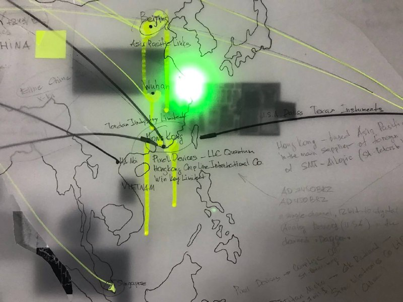
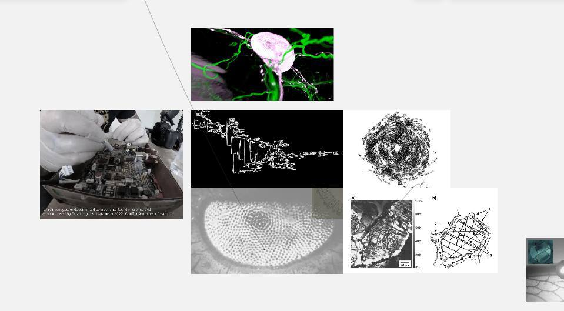
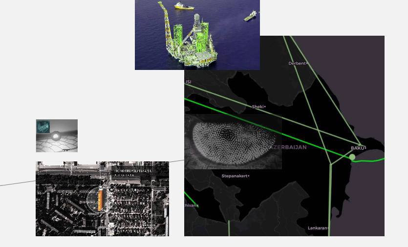
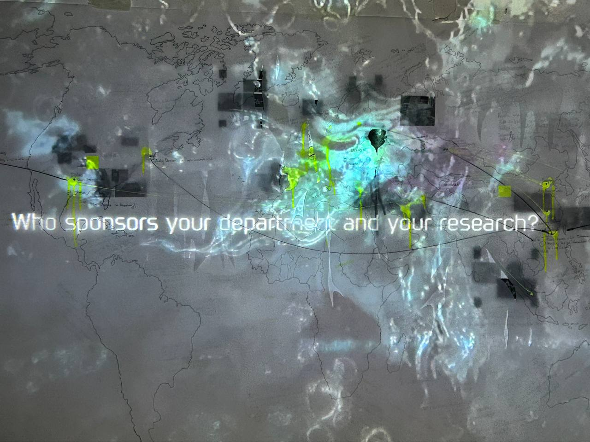

**SYSTEMS OF LIABILITY** 

The project explores the colonial nature of relations between russia and post-soviet countries, using the example of the formation of military logistics networks for russian full-scale invasion of Ukraine (2022).

**General content:**

text

video and transcript

map

**Text content:**

loyalty systems.

russian imports in numbers.

the list of countries.

What do we see on the arms and components supply map?

Erased borders.

Hybrid regimes of map blurring by transnational capitals and neocolonial logics of subordination.

Flexible modulation of transnational military contractors' command networks in a state of permanent war.

Networks of a global empire of military concerns and their cross-national connectedness.

Networks materialize their boundaries through the detailing of connections, names, addresses, and nuanced logistics.

The network should be treated as a process and technology with algorithms of action but not as an object.

A worldwide war condition blurs the distinction between war and non-war, where "war becomes the basic principle of the organization of social life, and politics is only one of its instruments or embodiments" (A. Negri, M. Hardt "Empire").

Despite the apparent political autonomy of neighboring countries (former Soviet countries: Armenia, Kazakhstan, Kyrgyzstan, Uzbekistan, Tajikistan, Georgia, Moldova, etc.), russia continues to use its territorial neighbors as a transit zone to bypass the blockage of supplies of components for the military-industrial complex. The borders of sovereign territories are being re-drawn under the pressure of the diffuse space of the russian network of military contractors. Corrupt bypass routes for shadow imports become active and visible.

Shadow imports are necessary for russia to continue to replenish stocks and service the military-industrial complex.

The russian military-industrial complex is not independent and critically depends on imported components.

This is especially true for UAVs, secure communications, microelectronics, and machine tools for manufacturing parts.

The russian military-industrial complex is a direct successor of the soviet one. Over the past 30 years, very few new weapons have been put into serial production. The main focus of the russian military-industrial complex is on repair, support for the first, and modernization of what was produced during the USSR era. The new weapons samples under the russian outer shell consist of Western components at the level of engines, optics, processors, and microelectronics.

Contrary to myths about the impressive legacy of the soviet union, its own developments, and military production capacities, the russian military-industrial complex is a poorly coordinated, corrupt, and non-independent network of half-destroyed research institutes of the soviet period. Places, where import substitution of microelectronics and production methods takes place only on podiums in front of investors and in the weak imagination of officials, not existing in reality, the dynamics of the microelectronics industry and russian developments can be traced on the archived pages of the plant of Angstrem JSC ( moscow company engaged in the design and manufacture of electronic products and semiconductors. The company produced a number of Soviet-era integrated schemes. After the collapse of the USSR in the 90s, it produced a line of calculators and bank cards.) The plant, which was founded in 1963 under the name NII-336, and like the entire russian microelectronics industry, rapidly deteriorated after the collapse of the USSR 2.

2010: "The government will keep foreign parts out of defense products, cryptography, and passport systems To support russian microelectronics, the government agreed to provide local companies with orders, even if their products are more expensive than their foreign counterparts The government will support russian microelectronics" (c).

2010: "It makes no sense to create capacities for mass production of consumer electronics and electronic components with a low intellectual component, as the technological lag from the world leaders - the USA, Japan, Asia - is too great. There is nothing terrible in the fact that russia will continue to import from abroad electronics of mass demand - household appliances, TV sets, cell phones, GLONASS navigators, bank and trade cards, and other "colonial" goods (or to produce abroad for domestic consumption, but based on russian developments) - this is what all countries do today" (c).

2011: "Angstrem" started selling Huawei equipment.”

2011: "Vnesheconombank renewed Angstrem-T's credit line for 815 million euros. Former Communications Minister Leonid Reiman may have helped Angstrem-T reach an agreement with the bank.

Vnesheconombank's Supervisory Board has approved the resumption of financing for Angstrem-T, a source close to the Board told Vedomosti. The matter concerns a credit line for 815 million euros, which the bank allocated to this company in 2008 for the purchase of AMD licenses and equipment, as well as for the launch of a 0.13-0.11 micrometer microchip plant." (с)
2018: "U.S. sanctions targeting russia's nascent high-tech industry have caused a russian microchip company significant financial problems and delayed the launch of an initiative aimed at producing substitutes for Western products, the firm's owner said." President Vladimir Putin has emphasized the need to develop a domestic technology industry in russia to make it less dependent on Western equipment. But Moscow's efforts to produce russian microchips and other high-tech products have been hampered by U.S. sanctions against a number of russian technology companies. Angstrem-T, which makes semiconductors, has accumulated significant debts and is about to be taken over by state development bank VEB after failing to repay an 815 million euro loan."(c)

2019 Bankruptcy.

2023 Angstrem is placed under state management under the decree on the state defense order, enters with GC Element, a joint venture between Rostekh and AFK Sistema, and Angstrem-T goes under the control of the state-owned VEB.RF corporation

2023 disassembly into components by Ukrainian military experts: "Rashistka radio #Azart manufactured by #Angstrom. The radio contains five key #AnalogDevices chips." (c)

What do we learn here about the global supply of components for the military-industrial complex, except about the helplessness and collapse of russia's domestic microelectronics industry? The US imposed sanctions on Angstrem-T in 2016 for the annexation of Crimea in 2014, but in 2023, Angstrem-T will use microchips made in the US.

These details are also important because the Azart radio, assembled by Angstrem, is part of the Lorandit RP-377LR (radio-electronic reconnaissance) and REB (radio-electronic warfare) system, which is used in the war against Ukraine. That's being used in the war against Ukraine.  RER and REB play key roles in combat, as they read UAV signals and interfere with the piloting course of enemy UAVs.  That is, we realize that russian radio surveillance and radio warfare equipment are not without Western and Chinese manufacturers. At the same time, neither the U.S. nor the European countries provide lend-lease and aid to Ukraine.

russia does not have an extensive network of contractors for the military industry. Orders are distributed non-transparently within large holdings and corporations. Control over the fulfillment of orders is also hidden deep in the gut of an opaque but poorly coordinated machine. Since 2014, a network of foreign intermediary firms was registered and set up to supply components for the production of weapons. They, in turn, sent chips, microchips, etc., to military contractors - subsidiaries of the russian military-industrial complex, whose main enterprises were already under sanctions.

The sanctions boycott policies adopted in 2022 (and earlier in 2014) by the EU and a number of other countries no longer allow russia to obtain resources for direct warfare. However, the effect of sanctions 3 on military technology is severely weakened by the time lag, the merging of civilian and military technologies, and the enforced loyalty of the buffer countries that russia uses. Most importantly, russia continues to obtain components through old corrupt "business as a usual" relationships in European countries.

Some military logistics have been restructured to focus on production in Iran, China, and Turkey. However, Western components produced in the EU and the U.S. enter russia via Armenia, Kazakhstan, Kyrgyzstan, Belarus, and Uzbekistan.
Such cooperation and assistance in circumventing sanctions can hardly be called voluntary for the countries of the former USSR that share common borders with russia.

Human resources also play an important role in the colonial logic of warfare. Taking advantage of the pressure on the former soviet republics, russia promises russian passports to migrant workers from Central Asia for their participation in the war. In 2023, russia roundups and police raids on migrants who have obtained russian passports to serve them as military conscripts. External colonial logics are reflected in domestic politics: most of russia's army is made up of indigenous peoples, residents of national republics, and contract soldiers from economically disadvantaged regions. In Alabuga (Tatarstan), 15-year-olds are forcibly recruited to assemble Iranian Shahed combat drones for the needs of the russia army. The ideas of the "russian world" are paid for by those who were consistently exploited by the central regions and experienced genocides and ethnic cleansing by the empire.

We want to emphasize that the post-Soviet countries are deliberately used by russia, as the dependent quality of relations does not create conditions for symmetrical choices or the possibility of autonomous decision-making. In the example of Sakartvelo it is easy to trace the links of colonial pressure. Suffering 20% occupation of its territories by russia, Sakartvelo does not join the EU sanctions demands, despite the high level of internal solidarity of Sakartvelo residents towards Ukraine's struggle and despite the fact that Sakartvelo became a candidate for EU accession in 2023. There are many reasons for these apparent contradictions (threat of military intervention from russia, old corrupt ties between the countries, forced cross-border cooperation, transit deals, etc).

Also, the fact that many countries of post-soviet territories are linked to russia by forced labor migration plays a role in dependency relations. Migrant families are fragmented by labor-trade relations and forced linguistic-cultural integration in russia. And russian exploitative logics is the reason for this migration. Financial, scientific, educational, and cultural resources have been concentrated around the center ( moscow) without strengthening and developing local infrastructures, which makes people migrate for the missing flows in search of work, education, health care and better quality of life. The logics of capital and colonialism follow symmetrically, supporting each other.

Since the beginning of russia's full-scale invasion of Ukraine, the borders of post-Soviet countries have been experiencing unrest and anxiety. Tensions have materialized into border military conflicts (Tajikistan-Uzbekistan, Armenia-Azerbaijan) and mass rallies demanding local authorities stop flirting with the Kremlin. (Armenia, Kazakhstan, Georgia, Moldova).
Through external agents of influence, russia pressures and interferes in local elections, sabotaging paid rallies and riots. It threatens with economic pressure and cutting off access to energy resources, forcing neighboring countries into political deals loyal to itself.

We see diffraction and plurality in the ideas of territorial independence and state sovereignty. Logistic flows furrow and redraw political and geographical maps, subjugating new territories and redefining them. The economic dependence and connectedness of the post-soviet space with the kremlin's central apparatus, subordinates the regional territories of russia in the logic of resource economy and encroaches on the fragile borders with neighboring states. Moscow is becoming a liquid and sticky matter, expanding its presence and extending its spheres of influence into more vulnerable regions on geographic or economic grounds.

There can be no equal and secure relationship with a government that looks at a neighboring independent state as a temporarily neglected territory and does not see it as a subject of its own history. On the other hand, russia looks at the former republics in a revanchist and, at the same time, condescending way. The histories of external and internal colonial conquests, genocides, and deportations in tsarist russia, the russian empire, and modern russia are still covered with Bolshevik myths of equality and friendship of peoples and false oppositions to Western imperialism.

What is the purpose of a full-scale invasion of Ukraine by russia? A war to establish or maintain a social order may not have an end. Therefore, it involves constant, unremitting use of violence and cruelty. It cannot be won, or, more precisely, it has to be won over and over again daily. We are looking at a policy of consistent genocide and destruction of the culture of a former USSR republic that has disassociated itself from the xenophobic narratives of the "russian world.”

Russia is not interested in new territories from the point of view of their local development. (this can be traced back to the occupation of Abkhazia and the subsequent abandonment of the territories). At the same time as new territories of Ukraine are being seized, the regions of russia are rotting, numerically and economically dying out, being an exploitative and reproductive zone for the center ( moscow).

Russia does not hesitate to make temporary making to obtain weapons and organize gray oil searching for totalitarian governments such as Iran, Turkey, and Azerbaijan. Azerbaijan helps circumvent sanctions on oil and gas sales to the EU by being a hub/redistribution zone and giving russian gas and oil products for Azerbaijan's oil and gas exports. Iran and Turkey are suppliers of drones, which are then passed off as locally produced by the russia (e.g. Geranium drones used in the war with Ukraine).

Also, russia supports and legitimizes such terrorist groups as Hamas (Palestine), Taliban (Afghanistan) and expands its presence in Africa by participating in local military coups.
Analysis of the schemes and channels of supply of components for the russian military-industrial complex reveals many countries involved, in addition to the former soviet republics. russia continues to receive all necessary dual-use goods and critical elements for weapons production. China, Turkey, and Iran are also significant partners. Having developed and joined the sanctions, western European countries and the U.S. are forced not to sell parts directly, but this still does not prevent the delivery of components to russia.

Many Western companies do not answer journalists' questions about export conditions of release and how to control the use of their products.

At the moment, we see stable supply networks on the map that help circumvent sanctions controls. And if, in the case of post-soviet countries, in many respects, we can understand the situation of non-choice, then the loyalty and rigidity of the rest of the countries: the UK, the USA, and Western European countries (France, Germany, Austria, Switzerland) - raise questions. 
Questions about the boundaries of expansion and the speed of geopolitical capital military-industrial geopolitical capital.

It is not the sanctions that work poorly but their adoption mechanisms and consistent enforcement procedures.

"The key condition that defines an ontological policy is its execution (performance)." Ann Marie Moll

**Footnotes:**

1.
*X-101 missile - at least 53 types of electronic component bases (microchips, chips) are foreign-made. In particular, components from such companies as STMicroelectronics (Switzerland), Vicor (USA), XILINX (USA), Intel Corporation (USA), Texas Instruments (USA), ZILOG (USA), Maxim Integrated (USA) and Cypress Semiconductor (USA).
Russia uses at least 45 foreign components to produce 3M-14 Kalibr sea-based cruise missiles. The 9M723 ballistic missiles and 9M728/9M729 cruise missiles of the Iskander complex are equipped with at least 15 and 32 types of foreign electronic component bases (ECB), respectively. At least 48 foreign components are used in the Kh-47M2 Kinzhal aeroballistic missiles.
A chip made by the world-famous American company Intel was found in the russian Tornado-S missile, particularly in the head section
In August 2022, the UK's Royal United Services Institute (RUSI), also examining russian missiles, found that russian weapons are critically dependent on Western electronics. Of 450 unique foreign-made components, more than a quarter bore the logo of Texas Instruments and Analog Devices, two American companies.*

*In the first seven months of the war, russia imported $2.6 billion worth of electronic components, at least $777 million of which were manufactured by Western firms, according to a joint investigation by RUSI (Royal United Services Institute) and Reuters based on russian customs data.
Allegedly "household" chips worth about $3 billion entered russia in 2022
https://www.liga.net/politics/articles/zapadnye-tehnogiganty-pomogayut-rossii-bombit-ukrainskie-goroda-kak-eto-ostanovit*

2

*https://en.m.wikipedia.org/wiki/Angstrem_(company) AO Angstrem is a moscow-based company engaged in the company engaged in the development and manufacturing of electronic products and semiconductors.
The company manufactured a number of soviet era integrated circuits. After the collapse of the soviet union, it produced a line of calculators and bank cards in the 1990s.*

*https://www.linkedin.com/posts/alexey-evstifeev-9288b829_азарт-ангстрем-analogdevices-activity-7130575077061869568-5zz- 2023: radiostation #Azart viroiznizstvo #Angstrem, Radiostation contains p'yat key microchips #AnalogDevices.
U.S. sanctions targeting russia's nascent high-tech industry have caused the russian microchip company significant financial problems and delayed the launch of an initiative aimed at producing substitutes for Western products, the firm's owner said.*

**NETWORK /video transcript/**

the text of the video uses quotes from AMBIENT INFORMATION SYSTEMS Luksch/Patel, and the full book is available here

 http://www.ambienttv.net/love

"We're swimming in a materialized stream of data -
or, more accurately, since this data
already interpreted and pre-processed,
we are drowning in (un)information.
Before
"intelligence reports can be analyzed,
war has already broken out on the other side of the Earth.

However, the scope
of individual action is becoming more and more
limited.
Voting and consumer
policies are strictly limited tools." ATV

info-techno capitalism, blurred lines between military and civilian technologies, hydrocarbon deals, it's just business, "for our children,” I'm just looking at violence, escort subsidy, digitized migrant footprints - the new Babylon.
Networks put an end to postmodernism and the helpless hum of abstraction.

Networks can replace postmodernist
relativism with data analytics, eliminating disorientation.
traps, dead ends, and mirror halls are also fields 
and spheres for intervention.

Understanding networks as biotechnology allows for co-authorship and racialization. taking ontological instability as a given, we can look at ways of constructing and playing with networks as visualizations of the ideas of new materialisms. 
The network is more than a "topology of nodes in space" but rather a matter of affects, fluid entities, at once
human and non-human,
cultural and technological.

and if it is through the node that the network materializes its boundaries, we can influence and reconfigure the algorithms of its construction.

how many engineers and scientists work indirectly or directly for military research?

The network slices, stitches, fragments... the network is an event, but not an object.

"We view data networks as a creative
environment not to glorify the technological
idea of progress, but to demystify the
technologies of everyday life - to make them
visible and to encourage productive use
rather than consumption, so that we can
responsibly utilize the considerable
power that is within our reach."

The network can be an effective organizational form and, therefore, can easily become a space of capture - a totalitarian space. a space of diffuse forms of control.

the way of the monster, technologically inflated by power,
co-opted into exploitation - whether or not
whether we can reconcile repression or not, one in eight people on earth lives in slums, and the rest will be shuttled back and forth between the
entertainment zone and the export /excort/ subsidy zone. ATV

and if the Net has the ability to "transform and mutate.”
it is not autopoetic, though. 
Technology provides its own junctures, hence the name "material semiotics.”
hence the name "material semiotics" (Donna Haraway).

where the technological means
by which
data are co-producers
of meaning (B. Latour)

where the boundary 
of the "neurological turn" - an attempt
cognitive mapping
of our behavior via the Internet and the boundary of data collection policies and chosen alienation/ignorance from the introduction of networks into our everyday lives?
 
Who sponsors your department and your research?

**OVERALL NUMBERS OF RUSSIA'S IMPORTS:**

(information collected from public sources)

The main increase in exports from the EU to the countries of the former Soviet Union was for goods that fell under the anti-Russian sanctions - it amounted to 95%. Exports of these goods to Russia collapsed by 71%. For example, in November 2021, the total exports of these types of goods to Belarus, Armenia, Georgia, Kazakhstan, Uzbekistan, and Kyrgyzstan amounted to only €500 million, but in November 2022 they tripled to €1.5 billion.

In the last six months of 2023, Russian authorities cleared components of the U.S. Analog Devices Inc. worth more than $98 million, Xilinx - more than $75 million, Microchip Technology - more than $42 million, Texas Instruments - at least $38 million, as well as Infineon, Germany's largest semiconductor manufacturer - more than $28 million, according to customs data. Marvell (chip manufacturer) imported more than $11 million worth of products, Cypress Semiconductor - more than $3.8 million, and Atmel - more than $2.7 million.

In addition, US Intel and AMD products, including microprocessors, worth more than $169 million and $35 million, respectively, were imported into Russia.

China is Russia's largest trading partner, with its exports to Russia increasing by $8.5 billion in 2022 compared to 2021, according to UN Comtrade data. But in percentage terms, it is not the biggest growth: Turkey, Armenia, and Central Asian countries occupy the first five places.

According to the UK's Royal United Services Institute for Defense Studies (RUSI), Russia never stopped importing Western electronics. From March to October 2022, it imported more than $2.6 billion worth of it, with almost $777 million worth of chips and components from companies such as Intel, AMD, Texas Instruments, and Analog Devices.

The analysis conducted by Euromonitor experts is even more curious. It showed that exports of goods from the European Union to Russia from March to November 2022 fell by 47%, while exports to Belarus, Armenia, Kazakhstan, Georgia, Uzbekistan and Kyrgyzstan increased by 48% over the same period, RBC reported. 

Since the start of the all-out invasion of Ukraine, Russia has increased the value of imported microelectronics to $2.45 billion, up from $1.8 billion in 2021. The International Working Group on Russian Sanctions identified that at least 1,057 foreign components made by 155 companies are used in Russian weapons.

**Summary information on the COUNTRIES OF SANCTIONS AND GRAY EXPORT:** 

**KAZAKHSTAN:**

Although its government has declared neutrality in the Russo-Ukrainian war, its trade with Russia suggests otherwise. Kazakhstan has become a major channel for supplying technology to Russia and circumventing Western sanctions. Last year, Kazakhstan's imports from the EU rose 89 percent to 10.4 billion euros. This increase includes significant purchases of technology and equipment (worth about €4 billion). Some €2.6 billion worth of goods went missing, thus becoming "ghost goods" - goods that were officially purchased by Kazakhstan from the EU but never reached consumers in Central Asia.

In 2022, EU trade with Kazakhstan totaled €40.2 billion, 74% more than in 2021. EU exports totaled €10.4 billion, up 89% from 2021, while imports from Kazakhstan reached €29.8 billion (up 70% from 2021.) 2021). The trade balance amounted to €19.5 billion in favor of Kazakhstan, compared to €12.1 billion in favor of Kazakhstan in 2021.

Almost 1 billion of this amount went to machinery and engineering, although Kazakhstan does not produce most of these goods. Last year, Kazakhstan sold 3.3 million euros worth of semiconductor components to Russia, although this trade amounted to only 11,000 euros in 2021.

Kazakh Deputy Prime Minister Serik Zhuangarin, who is also the Central Asian country's minister of trade and integration, confirmed reports that Kazakhstan has exported sanctioned dual-use technology to Russian companies believed by investigative journalists to be involved in supporting Moscow's war in Ukraine. Zhuangarin said on June 27 that the Kazakh government is currently working to prevent the export of 104 types of goods to Russia, adding that controls on companies involved in such exports have been strengthened

Germany's export growth by 136% with Kazakhstan.

According to an editorial source who supplies Kazakhstan with products from China, there is a special "green" list of companies whose vehicles are not inspected: "The companies on the list are constantly changing, so it is difficult to track them down. The list is compiled, he said, by "those at the top.”

You can learn more about what is happening on the land border between Russia and Kazakhstan in this video report.More than 500 drones were sent to Russia in 2022 by the Kazakh company Aspan Arba. It was registered in Kazakhstan already after the war started - in April 2022. Industry portal Metalmininginfo reported that Aspan Arba would be the official dealer of DJI drones in Kazakhstan and will supply copters for the mining industry, "construction, power generation, search and rescue operations, and agriculture.”

According to data from Kazakhstan's Ministry of Digital Development, Defense and Aerospace Industry, Aspan Arba has received a license to import 18,000 DJI drones worth $45 million. The exporter is DJI Europe B.V., a Dutch subsidiary of the Chinese company. Five hundred drones, "Aspan Arba," sent to Russia "Heavenly Mechanics.”

"Aspan Arba" can be translated from Kazakh as "Heavenly Wagon". But it is not only the names of the Kazakh and Russian companies that are similar. "Ilya Golberg, the same name as the founder of Aspan Arba, owns Heavenly Mechanics. Mikhail Sapozhnikov, the current director of Aspan Arba, was previously co-owner of Heavenly Mechanics with Golberg. The phone numbers listed on Aspan Arba's website in the leaked data of the courier company SDEK appear to be those of an employee of Celestial Mechanics.Who else purchased drones from Celestial Mechanics?

In April 2022, drone DJI Mavic 2, with a total value of 11 million rubles from " Heavenly Mechanics," bought the Moscow regional federation of veterans of armed conflicts "Lynx". Its founder and the only board member listed on the website is Special Forces Lieutenant Colonel Andrei Mezhevykh

The largest buyer of "Heavenly Mechanics" in 2022 - early 2023 was the company " DJIay ars Moscow,” which received goods for almost 500 million rubles. " DJIay ars" under the Digbox brand sells drones and other equipment on Ozon.

In 2022 and early 2023, Elix-st sent Da Group in Kazakhstan components worth more than $800 thousand, including products from manufacturers such as Analog Devices, Infineon, Texas Instruments, and STMicroelectronics, which claim they no longer cooperate with Russia. Da Group, in turn, sends components to Russia, mainly to Stack. Thus, in January 2023, Da Group received 2,598 Onsemi brand integrated circuits from Elix-st from Germany. In the same month, 2,598 ICs from Germany were shipped by Da Group to Stack-st in Russia. At the same time, in 2018-2021, i.e., before the war, Elix-st did not import goods to Kazakhstan (and, on the contrary, imported them to Russia).

How did "Stack" get the right components?

In the suburbs of Stuttgart, one of Germany's most important industrial centers is the office of Elix-st. It is owned by Russians Evgeny and Elena Chernet. In Russia, they own a similarly named company, "Elix-M". In Kazakhstan's Astana, the company “Da Group 22” was registered in March last year. Its owner and manager is Alexander Chernet.

In 2022-2023, “Stack” was imported from Kazakhstan components (integrated circuits, diodes, transistors, and others) for 4.2 million dollars. Customs data does not contain information on which manufacturers' products it was, but there is data on the countries of origin of the goods - it is Hong Kong, Germany, the Netherlands, and Singapore.

Among Stack's clients, the website mentions the special design bureau of MPEI, a developer of radio-technical systems within Roscosmos, and the Moscow Searchlight Plant, a manufacturer of power supply systems for Russian missile systems.

Another company importing U.S. microelectronics to Russia is Russia's "Prime-Ek." In particular, it imported $3.1 million worth of components through Kazakhstan in 2022-2023. Prime-ek itself is not particularly known for anything, but it has a partner with a similar name - Prime, to which Prime-ek supplied electronic components worth more than 100 million rubles in 2022. Their offices were located in the same building, and the contact phone number listed on Prime's website appears in the leaked data of the SDEK courier service as Prime-Ek's phone number. Last year, one of Prime's largest clients was the Penza-based Elektropribor production association, part of Rostec's Avtomatika concern. It produces communications equipment for the Ministry of Defense, such as the P-240I complex, which the Russian military in Ukraine uses to communicate in the field.
But in a single day in December 2022, a Kazakhstani firm called EltexAlatau exported more than 100 shipments of dual-use electronics to Russia.

Global computer imports to Kazakhstan increased sevenfold to $1.2 billion in 2022 from the previous year, including $310 million from the EU. Meanwhile, Kazakhstan's exports to Russia in this category grew more than 2,300 times year-on-year to nearly $300 million. Meanwhile, according to UN trade data, Kyrgyzstan did not import or export a single part for airplanes, helicopters, or drones in 2021. But in 2022, Kyrgyz firms imported $3.5 million worth of such parts - mostly from the United States - and exported $1.5 million worth to Russia.
​​​​​​​
**KYRGYZSTAN:**

For 2022, total imports of goods into Kyrgyzstan increased from $5.5 billion to $9.6 billion, up 72.6% from 2021. Of these, imports of "machinery, equipment, and apparatus" increased from $770 million to $1.6 billion, or more than doubled, while exports of "machinery, equipment and apparatus" nearly doubled from $101 million to $197 million.

Russia is Kyrgyzstan's second-largest trading partner after China, accounting for 27.4% of Kyrgyzstan's total trade turnover with all countries. Kyrgyzstan's foreign trade turnover with Russia increased by 40.3% in 2022 compared to 2021, while exports from Kyrgyzstan to Russia increased by 245% from $393 million to $963 million in 2022. Russia is the largest export destination for Kyrgyzstan, with a total share of 44.1%, making Kyrgyzstan economically dependent on Russia.
Exports from Kyrgyzstan grew 250% to over $960 million. At the same time, some goods (such as rifle scopes) were not previously supplied by Kyrgyzstan to Russia.

After Russia's invasion of Ukraine, German exports to Kyrgyzstan skyrocketed 994% to 170 million euros.
For example, Kas Impuls (the first detonator plant in Central Asia) supplied 661,000 detonators to Russia from January to April 20 2023. The plant itself produced at least 19.6 thousand of them; the rest may have been shipped from China. The recipient was ORICA CIS, a member of the Evoblast Group, a Russian manufacturer of industrial explosives and initiation systems for the mining and construction industries.

None of the deliveries by Kas Impuls is reflected in the official statistics of Kyrgyzstan. It is difficult to estimate how many more such supplies have "disappeared" from the reports.

According to UN trade data, Kyrgyzstan did not import any spare parts for airplanes, helicopters and drones in 2021. But in 2022, the country imported $3.5 million worth of such products - mostly from the United States - and exported $1.5 million worth to Russia.

Kyrgyzstan exported 115,920 electric detonators worth $882,400 to Russia in 2022, although it made no shipments in 2021. Electric detonators are used in the production of anti-personnel and anti-tank mines. Kyrgyzstan, for its part, imported 193,536 electric detonators from Canada worth $3.7 million in 2022. There is reason to believe that Kyrgyzstan re-exported Canadian-made electric detonators to Russia.

Exports of military equipment for radar, radio navigation, and remote control totaled $169,800 in 2022, up 60% from 2021.
Optical sights (for weapons) exported from Kyrgyzstan to Russia in 2022 amounted to 199,700 USD, 13 times more than in 2021.
Supplies of spare parts for airplanes, helicopters and drones from Kyrgyzstan to Russia increased from zero in 2021 to $1.5 million in 2022.

Kyrgyzstan did not export parts for lasers, instruments, and optical devices to Russia in 2019-2021, but exports reached $193,100 in 2022.

Companies: 

Tro.Ya stands in favor of supporting Russia's military sector. RM Design and Development has made hundreds of shipments of semiconductors, electronic integrated circuits and capacitors. "GTME Technologies" - deemed by the U.S. Treasury Department to have supplied tantalum capacitors and electronic integrated circuits to Russia. "Progress Leader" - supplied a number of goods to the Russian company Siaisi, which mainly trades in electronic and "Cargoline" - supplied $1 million worth of sanctioned goods to Russia. In particular, optical equipment and computers. aircraft parts for Boeing and Airbus.
Weitmann Handeln Allianz imported Swiss equipment from Essemtec in 2022.

**ARMENIA:**

Armenia's exports to Russia grew 187% in 2022 to $2.37 billion.

A document stamped by the U.S. Bureau of Industry and Security said Armenia imported 515 percent more chips and processors from the United States and 212 percent more from the European Union in 2022 than it did in 2021. Armenia then exported 97 percent of those chips and processors. the same products to Russia, the document said.

In another document, the Bureau of Industry and Security identified eight categories of chips and components deemed critical to the development of Russian weapons, including one called a programmable valve array that was found in a model of Russia's Kh-101 cruise missile.

A document stamped by the US Bureau of Industry and Security said Armenia imported 515% more chips and processors from the US and 212% more from the EU in 2022 than it did in 2021, the article noted. "Armenia then re-exported 97% of the same products to Russia," it said
Germany's exports with Armenia increased 172%

Total trade for January-August 2023 exceeded $4.16 billion, a record since the collapse of the Soviet Union. Exports from Armenia to Russia totaled $2.3 billion during the period and for the first time exceeded imports, which totaled $1.86 billion.
Vietnam's exports to Armenia rose 380 percent, while exports from Mexico rose 324 percent and Japan 252 percent. Citing a document from the U.S. Bureau of Industry and Security, the New York Times recently reported that in 2022, Armenia "imported 515 percent more chips and processors from the United States and 212 percent more from the European Union than it did in 2021. Armenia then exported 97 percent of the same products to Russia.

Companies: Tako LLC of Armenia (under sanctions)

**TAJIKISTAN:**

Germany's exports with Tajikistan increased 154%

**SAKARTVELO:**

92% increased German exports with Georgia

**MOLDOVA:**

Moldova's Max Jet Service has shipped 0.5 billion rubles worth of aircraft parts to Russia since the start of the war, including for Boeing and Airbus. Max Jet Service founder Sergei Ranga 

https://istories.media/stories/2023/09/12/pochemu-samoleti-v-rossii-vse-yeshche-letayut/?ref=en.thebell.io

**UZBEKISTAN:**

MVizion imported equipment and chips for one of the Lancet manufacturer's contractors
In contrast to the personalized sanctions against Usmanov imposed last year by the United States, the European Union, Britain and Switzerland, the Treasury Department only mentioned that London had joined more targeted sanctions against USM Holdings.

While most of USM's largest assets are in Russia, the move also targeted Ahangarancement, Uzbekistan's largest cement company, and Digital Invest, a company that, according to privately owned Uzbek news site Gazeta.uz, owns a stake in telecommunications concern Ucell and "operates a labeling system" in Uzbekistan.

**COUNTRIES CONTINUING TO SERVE russia's military industrial complex:**

**SWEDEN**

Neuronetworks for the Ministry of Defense:
The family of Roscosmos head Yuri Borisov, who previously oversaw arms procurement at the Ministry of Defense and as deputy prime minister of the government, is in control of defense contractor JSC STC Modul. In particular, the Ministry of Defense purchased a neural network gas pedal developed by NTC Modul. Modul buys electrical equipment in Switzerland, from E-tec Interconnect AG.

Swiss company CODERE continued to supply equipment to the sanctioned plant "Electromashina" in Russia, which produces components for Russian tanks. It was purchased for 155.5 million rubles through an intermediary company Galika-CTS.
GF Machining Solutions.

In 2018, JSC In 2017, the Izhevsk Mechanical Plant in Udmurtia purchased an AgieCharmilles CUT 20 P electrical discharge machine from Swiss GF Machining Solutions for 169,648 euros. https://informnapalm.org/en/how-companies-from-switzerland-italy-and-germany-help-russia-circumvent-sanctions-to-produce-weapons/

Swiss manufacturer Fritz Studer AG is also cooperating with Russia. In 2018, the company delivered two Studer S21 CNC universal cylindrical grinding machines to PJSC Kuznetsov in Samara, the largest aircraft and space engine manufacturing company in the Russian Federation. This cost more than 316 million rubles.

By order of the Ministry of Defense of the Russian Federation, Kuznetsov produces engines for Tu-160 "White Swan" strategic bombers, deeply modernized Tu-160M, Tu-95MS and long-range Tu-22M3 aircraft. The Russians are now actively using all these aircraft in the war in Ukraine.

And in 2019, the Swiss manufacturer fulfilled the order of the only company that produces missiles for S-300 and S-400 anti-aircraft systems - JSC MMZ Avangard (Moscow). Russian troops near Kharkov used these weapons - S-400 and S-300 air defense missile divisions - in April 2022.

The Russian customer received from the Swiss company a CNC precision cylindrical grinding machine with the function of machining external and internal threads S30 worth more than 382,000 euros .The Instrument Design Bureau in Tula received equipment worth more than 722 million rubles from the Swiss company GF Machining Solutions. In particular, the Russian company purchased 23 MIKRON HPM 600HD milling machines, 12 MIKRON HEM 500U milling machines, 1 AgieCharmilles FORM 20 stamping machine and a MIKRON HRM 1150U milling machine. This Russian company develops weapons. For example, the Bureau produced the Pantsir anti-aircraft missile and cannon systems, which Russia is using in its war against Ukraine.

In 2018, Swiss manufacturer Sylvac SA sold an optical measuring system model Scan 52 worth almost RUB 3 million to the russians. The customer is OJSC Novosibirsk Ammunition Plant, which produces small arms ammunition, including 7.62×51 caliber ammunition.

The Tochnost sniper rifles that the Russian National Guard was armed with in 2017 are of this caliber. According to Reuters, a special unit of the Russian National Guard called Vityaz was operating in Bucha. So, this Swiss company also contributed to the tragedy.

The director of this company is Lino Derungs, a Swiss citizen. However, he has been doing business in Russia since the early 1990s. Switzerland has long known that Galika AG is closely linked to Russia. In 2019, journalists discovered that the company was supplying equipment for the production of Kalashnikov assault rifles to Venezuela. However, Swiss officials turned a blind eye to this fact.

"In 2012, Galika AG from Volketswil in the canton of Zurich supplied machines for the production of AK-103 assault rifles worth several million Swiss francs. The plant in the city of Maracay should be up and running by the end of 2019 and will produce 25,000 Kalashnikov assault rifles per year.

The export ban did not apply to equipment sold by Galika AG. This is because the equipment did not fall under the category of military equipment and was not considered so-called dual-use goods. This refers to those machines that can be used for military purposes
https://informnapalm.org/en/how-companies-from-switzerland-italy-and-germany-help-russia-circumvent-sanctions-to-produce-weapons/

**NETHERLANDS**

Woerd-Tech exported at least $1.2 million worth of Texas Instruments and Analog Devices microchips between March and November 2022. Among its partners was a Russian firm that supplied electronic components to a factory manufacturing electronic warfare equipment. Kudryavtsev ordered the goods and repackaged them as if to be shipped to the Maldives, but the actual recipient was Russia. https://theins.ru/politika/264391

**HUNGARY**

Hungarian firm Aluminiumarugyar Zrt sells gas tanks to Russian company Rusbal, a manufacturer of inflatable mock-ups for the army. https://theins.ru/ekonomika/261733

**AUSTRIA**

Components for warship engines:

Another buyers of products from Europe are oligarchs Iskandar Makhmudov and Andrei Bokarev. They control Kolomensky Zavod JSC, which supplies the Defense Ministry with diesel engines for warships. Parts for D500-type engines are sold to Kolomensky Zavod by Sipavag AG from Switzerland, D.Kudarauskienes Warehouse from Lithuania and Geislinger GmbH from Austria. https://theins.ru/ekonomika/261733

It is on the basis of diesel engines of D500 type that the enterprise produces engines for the Navy. Screw springs "Kolomensky Zavod" receives from Germany, from Heinrich Eibach GmbH. Safety valves are from HOERBIGER Wien GmbH in Austria. Engine parts of D49 type are from Piston Ring Manufacturer Prima from Poland. https://theins.ru/ekonomika/261733.

The Russian medium-range strike UAV Orion ( item 90) is equipped with an Austrian 86 kW Rotax 914 propulsion system manufactured by BRP-Rotax GmbH & Co KG, a subsidiary of Canada's Bombardier Recreational Products.
Also, the Austrian company Diamond Aircraft Industries not only supplied but also localized the production of DA42M-NG light aircraft in Russia, which are used for the needs of the FSB. https://site.ua/alexander.kovalenko/sankcii-rakety-i-korrelyaciya-i7xmrjg.

One of Unimatik's main suppliers (and through it, tank gun manufacturer Zavod No. 9) is EMCO GmbH of Hallijn. The company supplies the Russian defense contractor with lathe pulleys and brackets, clamping rings, toothed belts, and machine tools.
Austria's EMCO and Unimatik are longtime partners. They have even launched joint production. The company "Emco-Rus", in which EMCO GmbH has 65% of the capital, and Unimatik has 35%, still operates in Ekaterinburg. https://theins.ru/ekonomika/267552.

Arms and ammunition.

According to the EU COARM working group, Austria continued to export arms to Russia even after 2014. The exports up to 2020 included "smoothbore weapons with a caliber of less than 20 mm, other weapons and automatic weapons with a caliber of 12.7 mm," and "ammunition and fuse mounting devices and specially designed components." Together, they had an export volume of almost 19 million euros: Austrian-made Glock pistols, Steyr Arms, and automatic rifles.
AR-15​​​​​​​https://correctiv.org/top-stories/2023/11/07/deutsche-waffen-fuer-russland/

**POLAND**

D49 type engine parts - from Piston Ring Manufacturer Prima https://theins.ru/ekonomika/261733

**ESTONIA**

Night vision devices https://www.krone.at/2657939 St. Petersburg-based JSC Lomo is a manufacturer of optical systems for the Navy, Space Forces and Ground Forces. For example, Mowgli-2 and Mowgli-2M night vision sights for portable anti-aircraft missile systems. Lomo's semi-active self-targeting head also equips Krasnopol with high-precision (guided) projectiles. During the war in Ukraine, Krasnopol proved itself so well that the volume of production of such projectiles in 2022 has increased several times.

Lomo's European supplier, Estonia's Elsorel OU, supplies glue, glass-textolite, organic decomposition lamps, aluminum nitrate, and silver in semi-processed form to Orel's Proton-Elektrotex. It is affiliated with AO Proton, a major manufacturer of optoelectronics in Russia. To realize that Proton works for the military industry, it is enough to visit its website. Among its partners are Rostec, Almaz-Antey, and Tactical Missile Armament https://theins.ru/ekonomika/267552.
Marker Nordic Ou. The Tallinn-based firm supplied the Russian defense contractor with fiber optic harnesses, industrial glue, etc.https://theins.ru/ekonomika/261733 

From January to May 2023, the Estonian company Elmec Trade OU sent at least $250,000 worth of banned electronics to Russia.https://verstka.media/rassledovanie-kak-v-rossiyu-popadayut-lyubye-sankcionnie-tovary#25.

Elmec Trade from Estonia. This company exported approximately $2 million worth of Texas Instruments and Analog Devices microchips from March through November 2022, which drew intense international scrutiny. The U.S. Department of the Treasury imposed sanctions against Elmec Trade and its Russian partners, Kvazar LLC and Spetsvoltage LLC, in May 2023.
Idatrading, in 2022, shipped $50,000 worth of Analog Devices microchips to Russia, which amounted to all-time record revenue.
https://theins.ru/politika/264391

Gold Solution OU and Leolart.com transport Italian goods for Pumori Northwest from Tallinn, while Alekon OU provides warehousing services. - provide logistics and transportation services, supplying Russian defense contractors with products of European manufacturers. https://theins.ru/ekonomika/267552

According to Russian customs data, Elmec Trade Oü, an electronic components wholesaler based in the Estonian capital of Tallinn, shipped at least $17 million worth of goods to Russia between April 1 and Oct. 31. They included chips made by Analog Devices and other U.S. manufacturers, records show. https://www.reuters.com/investigates/special-report/ukraine-crisis-russia-tech-middlemen/

Sumar Tools OU supplies foundry models and core boxes of its own production to Invest-Stanko LLC of Khimok. This Moscow Region company provides machine tools to JSC Zavod No. 9 - This Moscow-based company provides machine tools to Zavod No. 9, a Rostec-affiliated enterprise that is responsible for the production of barrel artillery systems.Key products include cannons for T-72 and T-90 tanks. It has also been reported that this plant will produce cannons for the Armata. https://theins.ru/ekonomika/267552

**FINLAND**

Meconet OY supplied copper tape and semiconductor parts to TD Proton-Elektrotex during the war. This company is affiliated with Proton, which, in addition to VOMZ's government contracts, works for Rostec, Almaz-Antey, and Tactical Rocket Armament and does not hide it. ​​​​​​​https://theins.ru/ekonomika/267552

**LATVIA**

Until it was recently liquidated, Riga-based Baltic Machinery supplied Ekaterinburg-based Unimatik with O-rings, couplings, and other goods. This used the customs warehouse in Vilnius of the Lithuanian UAB Didneriai. https://theins.ru/ekonomika/267552

**LITHUANIA**

Aircraft parts

The Russian airline I-Fly bought aviation parts from the Lithuanian Right Direction Aero - spare parts from European and American manufacturers, including for Boeing, for more than 145 million rubles. The director and owner of Right Direction Aero - Pavel Chalapov The customs databases indeed indicate that the Lithuanian Right Direction Aero sold goods to I-Fly on behalf of Cargoline. It seems that according to the documents, the spare parts were going to Kyrgyzstan, but in reality, they were going to Russia. 

https://istories.media/stories/2023/09/12/pochemu-samoleti-v-rossii-vse-yeshche-letayut/?ref=en.thebell.io.
UAB Elfanta is involved in the export of washers and plugs for lathes of Austrian origin to Unimatik (ROSTECH).

**CZECH REPUBLIC**

Aircraft components

In particular, the Czech company Apram Aerospace supplied aircraft parts to I-Fly and other Russian companies both before and during the war. Apram Aerospace has been on the market since 2012, and its owners are Czech citizens Alena Šimečková and Milan Kochan. In her LinkedIn profile, Shimechkova indicated that she worked for Job Air Logistics, another of Kochan's Czech companies that also supplied aircraft parts.
​​​​​​​https://istories.media/stories/2023/09/12/pochemu-samoleti-v-rossii-vse-yeshche-letayut/?ref=en.thebell.io

**FRANCE**

The French company Marchante supplied the Russian arms company Kurganpribor with technical products during the war. https://theins.ru/ekonomika/261733

Microcircuits for GLONASS

Information Satellite Systems (ISS) is one of the largest contractors of Roscosmos State Corporation. ISS carries out orders for the development and production of spacecraft as part of the development of the GLONASS navigation and positioning system and the Gonets-M satellite communications system for the interests of the Ministry of Defense. GLONASS plays an important role in ensuring the combat capability of the Russian Armed Forces: the system is used in high-precision weapons and unmanned aviation and is used at the level of operational control of troops. In 2022, 9 spacecraft of various purposes (including military and dual-purpose) produced by "ISS" were launched into orbit.

"ISS" is only under US sanctions. Therefore, it can be freely imported from European switches, which are used in microcircuits of on-board control systems of rockets. The supplier is Radiall S.A. of France. https://theins.ru/ekonomika/261733
spare parts:

French company ECA Group has been supplying Inspector Mk 2 uncrewed boats and Seascan Mk 2 underwater mine defense vehicles to Russia's Sredne-Nevsky Shipyard JSC for several years.
French Inspector Mk 2 systems from ECA Group have been integrated and are being used by the Russian Navy's Project 12700 "Alexandrit" minesweepers
Russian Su-30SM fighters were equipped with windshield background indicators (HUD) manufactured by French company Thales HUD 3022 https://site.ua/alexander.kovalenko/sankcii-rakety-i-korrelyaciya-i7xmrjg

humanitarian aid to rf troops:

Auchan chain of stores in rf : Auchan was not limited to its stores in St. Petersburg in supplying the occupation troops. This is evidenced by the fact that supplies were coordinated with the Moscow office and that aid collections in Auchan-owned shopping centers were also reported in other regions. For example, in Samara, Rybinsk and Vladimir, collection points for "humanitarian aid for Donbass" were opened in Auchan stores.https://theins.ru/en/politics/259460

nuclear fuel:

Lingen nuclear fuel plant of the French Framatome group Uranium dioxide is planned to be transported to MSZ Machinery Manufacturing, Joint Stock Company (MSZ JSC), part of the Russian state-owned corporation Rosatom. Rosatom is a civil-military conglomerate with no clear dividing lines. As noted in a new newsletter by alternative Nobel Prize winner Vladimir Slivyak, aired on behalf of, the Russian state-owned concern is directly and indirectly involved in the war against Ukraine - far beyond the occupation of the Ukrainian nuclear power plant in Zaporozhye. 

​​​​​​​https://www.ausgestrahlt.de/presse/uebersicht/geplante-uranexporte-von-lingen-nach-russland-vers/

**ITALY: ​​​​​​**

Armored vests

The manufacturer of armored vests for security and military personnel JSC NPP "CLASS" imported a cutter from Italy. Supplier - Minelli Carmello. https://theins.ru/ekonomika/261733.

FOOTWEAR FOR THE MILITARY

"Donobuv" also supplies shoe glue (sender - Jakob KECK Chemie GmbH) and leather (Salamander SPS GmbH & Co. KG) from Germany, and imports soles from Italy (Tacchificio Campliglionese).

Both the Italians and the Germans continued to supply Donobuv even after February 2022. Salamander also sells leather to another contractor of the Ministry of Defense during the war, JSC Faraday Company. https://theins.ru/ekonomika/261733.

Machine tools and components:

In May 2023 Unimatik (the company imported machine tools from Italian O. M. V. and German Arinstein worth at least $5 million) brought in milling machines. They were sent from Italy by O. M. V. Officine, despite the fact that this particular type of production is also under the export control of the European Union. One of the main state customers of Unimatik is Plant No. 9, Russia's leading manufacturer of tank guns.

2019 Italian manufacturer Hexagon Metrology S.p.A has sold a Micra Hexagon Metrology coordinate measuring machine worth more than 171,000 euros to Russian OAO Izhevsk Electromechanical Plant KUPOL. KUPOL supplies the Russian Ministry of Defense with Tor air defense systems, which the Russians are actively using in the war against Ukraine. https://informnapalm.org/en/how-companies-from-switzerland-italy-and-germany-help-russia-circumvent-sanctions-to-produce-weapons/

M.T.S.R.L. of San Giovanni in Marignano (Rimini) - Spare parts for machine tools "IPK Finval" - ROSTECH supplier for Uralvagonzavod, - T-90M "Breakthrough" (tank).https://theins.ru/ekonomika/267552

Norblast S.R.L. of Bologna imported a blasting machine from Pumori North-West Ltd. of St. Petersburg (it is a defense supplier of machine tools for metalworking to both VOMZ and Tactical Missile Armament Corporation).

From C.M.S. S.P.A. of Zogno (Bergamo), "Pumori Northwest" bought steel needles, filter cartridges, shut-off valves, polymer rings, and other components during the war. From Devco S.R.L. (Paderno Duniano, Milan) - milling machines for metalworking (the delivery amount in December 2022 amounted to 50 thousand euros). From Magido Group from Trezzano sul Naviglio, the Russian defense contractor purchased an automatic machine for washing metal products.https://theins.ru/ekonomika/267552

**GERMANY**

SHOES FOR THE MILITARY

"Donobuv" also supplies shoe glue (sender - Jakob KECK Chemie GmbH) and leather (Salamander SPS GmbH & Co. KG) from Germany, and imports soles from Italy (Tacchificio Campliglionese).

Both the Italians and the Germans continued to supply Donobuv even after February 2022. Salamander also sells leather to another Defense Ministry contractor during the war, JSC "Faraday Company.” https://theins.ru/ekonomika/261733.
Ammunition Thuringa-based Merkel Hunting and Sporting Arms Ltd, ammunition manufacturers Nammo Schönebeck, RWS, and Ruag Ammotech, and Eben Blaser of Algoi.https://correctiv.org/top-stories/2023/11/07/deutsche-waffen-fuer-russland/

Machine tools for missiles Moscow-based Stan LLC is a developer of state-of-the-art numerically controlled machine tools that is part of Rostec State Corporation. Despite the fact that Rostec is under sanctions, the German company Vansped Logistics (on behalf of Reißaus & Baumberg Maschinenbau GmbH) has been supplying Stan with technological equipment for foundry production since the beginning of the war. According to the ImportGenius database, the deliveries were made in July 2022.
According to the database of public procurement analysis, Stan LLC has concluded 125 contracts totaling more than 14 billion rubles. 

Among the contractors stand out:

PJSC "ODK-Kuznetsov" - produces engines for Tu-160M strategic missile carriers; JSC "Uralvagonzavod Research and Production Corporation" - Russia's only designer and manufacturer of tanks; JSC NIKIET is the leading organization for the disposal of nuclear submarines; JSC Admiralty Shipyards is the main center for the production of non-nuclear submarines; JSC Concern Marine Underwater Weapons-Gidropribor is a manufacturer of torpedoes and sea mines; JSC Kometa Corporation is part of the Almaz-Antey Air and Space Defense Concern (ASDC) and is engaged in the development of the space echelon of the Russian ASDC system. https://theins.ru/ekonomika/261733

in 2018, the largest aircraft engine manufacturer in the Russian Federation, PJSC ODK-UMPO (Ufa, Bashkortostan), received a WALTER HELITRONIC MINI POWER universal grinding machine for more than 81 million rubles from the German company Walter. By the way, in 2018, ODK-UMPO started developing an engine for the SU-57 fighter jet. In May 2022, Russian propagandists boasted of testing fifth-generation Su-57 fighters in the war against Ukraine.
In 2019, JSC NPP Kaluga Instrument-Making Plant Typhoon received a TNA 400 lathe worth 260,000 euros from German manufacturer Index Traub. The Russian company produces radar stations for surface ships of the Russian Navy and coastal missile systems. The Bal coastal missile system equipped with anti-ship cruise missiles is produced here. It is used for shelling Ukraine from Crimea.

In the same year, Russia's Chepetsky Mechanical Plant (Glazov, Udmurtia) received a Planomat HP 412 CNC profile grinding machine for more than 41 million rubles from German manufacturer Blohm Jung GmbH.
Chepetsky Mechanical Plant is part of Rosatom, whose employees took part in the takeover of the occupied Zaporozhye nuclear power plant. The enterprise also occupies one of the most important places in the technological cycle of the production of nuclear fuel based on natural uranium.

The German company Blohm Jung GmbH explicitly states on its website that it is part of the UNITED GRINDING Group with specialized branches for international markets in India, China, Russia and the USA. https://informnapalm.org/en/how-companies-from-switzerland-italy-and-germany-help-russia-circumvent-sanctions-to-produce-weapons/.

The German firm Wwsemicon is another example. Until 2015, its owner and director was Vladimir Avetisyan. The same person, as it follows from Russian court acts, controlled the firm Kompel JSC. Before the war, Compele JSC was an official distributor of Texas Instruments products. Customs data show that between March and November 2022, Wwsemicon imported more than $1.6 million worth of Texas Instruments and Analog Devices microchips. Its almost exclusive Russian partner was JSC Komple, which also received government orders from military enterprises.https://theins.ru/politika/264391.

WTO Werkzeug-Einrichtungen GmbH is a supplier to several Russian defense contractors. It sends parts for lathes to OTS-Technology LLC in Ekaterinburg, and OTS-Technology sells tools to Zavod No. 9 and Uralvagonzavod. WTO Werkzeug-Einrichtungen also supplies tooling blocks to Penza-based OOO TD SMS, which is affiliated with OOO Stankomashstroy, which supplies machine tools to Rostec

Another importer of WTO Werkzeug-Einrichtungen products is Unimatik, also a contractor of Plant No. 9. https://theins.ru/ekonomika/267552.

Last November Oxapa GmbH from Jena supplied optically treated glass blanks to NPK Macrooptika LLC from Ryazan. This is one of the leading Russian manufacturers of optical and mechanical systems for aircraft and military equipment, a contractor of VOMZ, other Rostec structures, as well as the FSB, the Defense Ministry, and Tactical Missile Armament. https://theins.ru/ekonomika/267552.

Rudi Gebel Gmbh & Co. Kg from Helmbrechts supplies parts for the assembly of power semiconductor devices to the very Oryol-based Proton, which also imports products from Estonia and then supplies optoelectronics to military enterprises. ​​​​​​​https://theins.ru/ekonomika/267552

**TURKEY**

Radio electronics Turkish Turkik Union And Dijital Teknoloji, which supplied Radiopriborsnab* with $24 million worth of components in 2022, is run by Mustafa Cankat Aytek. https://istories.media/stories/2023/01/25/zapad-zapretil-prodavat-rossii-komplektuyushchie-dlya-proizvodstva-oruzhiya-no-rostekh-ikh-uspeshno-pokupaet/

Azu International, co-founded by Turkish businessman Gokturk Agvaz, stepped in to help make up the supply shortfall. According to Russian customs data, the company exported at least $20 million worth of components to Russia over the next seven months, including chips from U.S. manufacturers. Azu International is an example of how supply channels to Russia remained open despite Western export restrictions and manufacturer bans. At least $2.6 billion worth of computers and other electronic components entered Russia in the seven months through Oct. 31, Russian customs data show. At least $777 million worth of those products came from Western firms whose chips have been found in Russian weapons systems: the U.S.-based Intel Corp, Advanced Micro Devices Inc (AMD), Texas Instruments Inc., and Analog Devices Inc., as well as Germany's Infineon AG.

One Russian importer, Fortap LLC, based in St. Petersburg, was set up by a Russian businessman in April and has since imported at least $138 million worth of electronics, including computer parts, from the United States, according to Russian customs data. They show that one of Fortap's biggest suppliers is Turkish company Bion Group Ltd Stihttps://www.reuters.com/investigates/special-report/ukraine-crisis-russia-tech-middlemen/

Azu International - it was founded in March 2022 in Istanbul. Its co-founder is Turkish businessman Gokturk Agvaz, who also runs Germany's Smart Impex GmbH. Both structures specialize in the supply of IT products.

A week after its establishment, Azu International started shipping goods to Russia. During the first seven months of its operation, according to the agency, the company exported at least $20 million worth of components to the country, including American-made chips.
https://www.bbc.com/russian/features-65234429

**CHINA**

radio electronics

Hong Kong-based Tordan Industry Limited is owned by Dmitry Rebus, director and owner of Saratov-based VMK. Last year it imported almost $30 million worth of components to Russia's Radiopriborsnab*. 
Testkomplekt has many Chinese suppliers dozens of companies from both Hong Kong and mainland China. The largest is the Hong Kong-based United Electronics Group Company Limited, owned by Yuri Zhukov.

*Radiopriborsnab is the procurement department for electronic components for KRET's enterprises (he represents it that way in all documents). In 2021, Radiopriborsnab's revenue from selling electronic components to KRET's enterprises amounted to almost 10 billion rubles. The main buyers in 2022 are KNIRTI, NII Ekran (the lead developer of Vitebsk), and Ryazan Instrument Plant (avionics, radars, and others).https://istories.media/stories/2023/01/25/zapad-zapretil-prodavat-rossii-komplektuyushchie-dlya-proizvodstva-oruzhiya-no-rostekh-ikh-uspeshno-pokupaet/

microelectronics

In May 2022, Hongkong Chip Line International Co. Limited supplied a batch of AD7450BRZ microchips manufactured by Analog Devices to a Russian importer company, Quantum LLC, registered in Moscow. The AD7450BRZ is a single-channel 12-bit analog-to-digital converter that the Ukrainians found in the downed Dagger https://theins.ru/politika/264391.

Among the firms shipping Western technology to Russia is a Hong Kong-registered company called Pixel Devices Ltd. A Reuters journalist who visited Pixel Devices' office in a Hong Kong business tower found a small room with cardboard boxes stacked to the ceiling and no employees. There needed to be more signs that the company has shipped at least $210 million in electronics to Russia since April 1, including at least $50 million in Intel and AMD products through Oct. 31, according to Russian customs records. 31, according to Russian customs records.

According to Hong Kong and Singapore company records, the current owner of Pixel Devices is Singapore-based Asia Global Neolink Pte Ltd, which in turn is owned by Seychelles-based White Wings Ltd. The sole director of Pixel Devices is currently Spaniard Pere Roura Cano, who is also listed as a director of Asia Global Neolink and runs an aviation club in Catalonia. Roura Cano, who was contacted by phone in Spain, confirmed that Pixel Devices supplies semiconductors and other products to Russia.
Russian customs records show that Pixel Devices' main customer in Russia is a St. Petersburg-based company called CompLiga LLC. The company's website states that it can supply a wide range of IT products and components. According to customs records, KompLiga has imported at least $181 million worth of electronics since April 1, almost exclusively from Pixel Devices.

https://www.reuters.com/investigates/special-report/ukraine-crisis-russia-tech-middlemen/
drone components

Asia Pacific Links has supplied SMT-Ailogic* with $12 million worth of components since 2017, with about half of that amount coming from the start of the Russian invasion.
Virtually all of the goods that SMT-Ailogic imported into Russia came from China. Customs records indicate that these goods are non-military. 

*SMT-Ailogic describes itself as one of the largest suppliers of electrical equipment and spare parts in Russia. Since 2017, the company has imported approximately $70 million (about 4.5 billion rubles) worth of products into Russia, with annual shipments increasing tenfold over that time.

"SMT-Ailogic is a supplier customized for a single client. It supplies components to the sub-sanctioned STC ("Special Technology Center" (STC) company, which makes the Eagles)https://storage.googleapis.com/istories/stories/2022/12/15/zapad-zapretil-prodavat-rossii-komplektuyushchie-dlya-proizvodstva-oruzhiya-no-ona-ikh-uspeshno-pokupaet/index.html?_gl=1*1fcrvfu*_ga*NzUzMzc1OTk5LjE2OTg5MzM3OTU.*_ga_86829926PE*MTY5ODkzMzc5NS4xLjEuMTY5ODkzMzg5NS4wLjAuMA

In November 2022, Hong Kong-based Win Key Limited shipped a batch of 28 ADF4351BCPZ-RL7 ICs manufactured by Analog Devices to Russian importer Azimut. The circuits are broadband frequency synthesizers found in Russian Tachyon drones shot down in Ukraine. In total, Win Key exported $2.6 million worth of Texas Instruments and Analog Devices microchips to Russia from March through November 2022. https://theins.ru/politika/264391

**UNITED STATES**

Universal Photonics of New York exports aluminum oxide and polishing powders to NPK Macrooptics and TPK RZM LLC. These Russian firms, in turn, are contractors of the Vologda Optical and Mechanical Plant, which produces sights for tanks.
Another importer of American Universal Photonics products is Morion JSC, which supplies the Russian defense industry with quartz generators.https://theins.ru/ekonomika/267552.

supply of components for drones.

Ik Tech supplied $2.2 million worth of goods to Russia between 2018 and 2021. More than 90% of these were SMT-Ailogic orders. Among these goods were, for example, almost 1,400 GUM3703FEBY processor modules manufactured by Gumstix - exactly the same ones found in Russian Eagles in Ukraine.

UAV "Granat" is equipped with Japanese camera "Canon", its electronic stuffing is made by American companies Intel Corporation and Pulse Electronics, the engine is made by Czech Model Motors and even the battery is American from MaxAmps... UAV "Aleron" uses primary camera Sony FCB-EX11DP and secondary Olympus Stylus TG-860. They also use a 32-bit microcontroller from Swiss company STMicroelectronics https://site.ua/alexander.kovalenko/sankcii-rakety-i-korrelyaciya-i7xmrjg

Guns

Smith & Wesson, Barrett Firearms and Desert Tech https://correctiv.org/top-stories/2023/11/07/deutsche-waffen-fuer-russland/

**SCOTLAND**

Following a shocking revelation, Glasgow-based Future Technology Devices International (FTDI) has come under scrutiny for allegedly selling microchips to Russia following the country's invasion of Ukraine. https://bnn.network/world/russia/glasgow-based-ftdi-accused-of-selling-microchips-to-russia-post-ukraine-invasion/

**DANIA**

Russian Navy insulation for warships. In 29 cases, sales were made through Rockwool's official partner and distributor, Marine Complex Systems LLC (MCS), a company that makes its living serving the Russian military. https://infonavigator.com.ua/analitika/s-2014-goda-kompaniya-rockwool-prodavala-sudovuju-izolyaciju-rossii-kotoraya-okazalas-kak-minimum-na-31-voennom-korable-vmf-rf/​​​​​​​

**UAE**
​​​​​​​
Dubai-based company Ats Heavy Equipment & Machinery. In just over a year, it made more than 700 deliveries to Russia for 3.9 billion rubles. Most of the spare parts for Boeing and Airbus went to Aeroflot Group, which besides Aeroflot itself includes Rossiya and Pobeda.

The beneficiary of Ats Heavy Equipment & Machinery is Jordanian citizen Mohammad Altahayneh. According to his LinkedIn profile, he has been working for Jordan-based Aerospace Technical Services since 2015. The company has been supplying spare parts for Boeing and Airbus for 20 years, and its customers include major European, Arab and Turkish airlines. The owner of Aerospace Technical Services is Jordanian citizen Al-Khayir Tahina.

Griffon (UAE). According to Sayari, its beneficiaries are Irina Gorokhovskaya and Ilya Rysyev. They graduated from the All-Russian Academy of Foreign Trade and worked there. Rysysev established two companies in Russia, Simplex and Ameritech, which supply aircraft parts.
https://istories.media/stories/2023/09/12/pochemu-samoleti-v-rossii-vse-yeshche-letayut/?ref=en.thebell.io

**SOUTH KOREA**

Seoul-based Mabuchi Korea Corporation supplies machine tool oil, lens grinding machines, polishing powder and other goods to the above-mentioned Ryazan-based Macrooptics Research and Development Company. Moreover, the deliveries have already started in January 2023.

Seolin Industry Inc. from Seoul supplies solutions, paints and other goods to Udmurt JSC Elekond. This is one of the leading enterprises of the Russian defense-industrial complex in the development and production of electrolytic capacitors. https://theins.ru/ekonomika/267552

**IRAN**

Iran Air Cargo, Safiran Airport Services and their parent company Iran Air are under U.S. sanctions for transferring Iranian drones to Russia with the help of Armenia. Russian Air Force IL-76MD aircraft were also used to transport Iranian drones through Yerevan. https://neweasterneurope.eu/2022/11/28/the-iranian-armenian-russian-axis-and-the-war-in-ukraine/
shahed drone co-production
https://investigator.org.ua/ua/investigations/255650/?fbclid=IwAR1DRYcFfPqDyGVpEdCp3y-rhM4w0iOSnbgNiBQy8lIArrIwivifdf65H5w

**CANADA**

The Russian Orion medium-range strike UAV (Product 90) is equipped with an Austrian 86 kW Rotax 914 propulsion system manufactured by BRP-Rotax GmbH & Co KG, a subsidiary of Canada's Bombardier Recreational Products.
https://site.ua/alexander.kovalenko/sankcii-rakety-i-korrelyaciya-i7xmrjg

**JAPAN**

Japan Industrial Trading (sealing rubber gaskets, cathode foil) and Kaga Electronics (ready-made electrolyte for production of electrolytic capacitors) Supply JSC Elekond - This is one of the leading enterprises of the Russian defense-industrial complex in the development and production of electrolytic capacitors. ​​​​​​​https://theins.ru/ekonomika/267552

**SERBIA**

The Serbian company Grindex D.O.O. makes high-precision grinding machines for grinding cylindrical surfaces. Their Russian customers include Unimatik, which helps produce cannons for tanks, and Krona LLC of Ryazan, which was a contractor for Uralvagonzavod.https://theins.ru/ekonomika/267552.

Virtus Zemun from Belgrade delivered a four-roll hydraulic sheet bending machine to the previously mentioned Pumori Northwest Ltd. in January.

